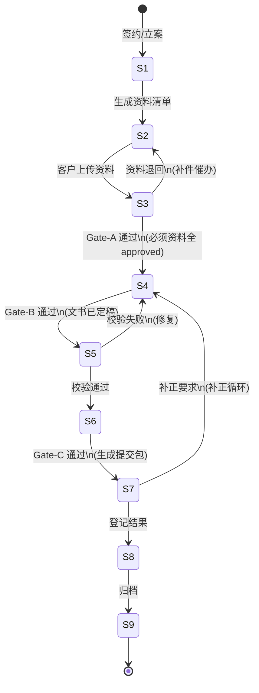

# Example Walkthrough: Case Lifecycle State Model

> Real repo example demonstrating the workflow-state-modeler skill.
> Source: `docs/gyoseishoshi_saas_md/P0/04-核心流程与状态流转.md`

---

## Scenario

User request: "为案件主链路建模状态机，输出状态转移表和 Mermaid 图。"

## Step 1 — Extract states from 04-核心流程与状态流转.md §1.2

| Code | Stage | Entry condition |
|------|-------|-----------------|
| S1 | 已建档 | 已签约/已立案，主申请人、案件类型、负责人已明确 |
| S2 | 资料收集中 | 资料清单已生成并发出 |
| S3 | 资料审核中 | 已有客户上传资料 |
| S4 | 文书制作中 | **Gate-A 通过** |
| S5 | 待校验 | 已进入提交前校验工作区 |
| S6 | 待提交 | 最新校验通过 |
| S7 | 已提交审理中 | **Gate-C 通过**，已生成提交包 |
| S8 | 已出结果 | 已登记结果与结果日期 |
| S9 | 已归档 | 案件已结案 |

## Step 2 — Extract Gate events from §1.4

| Gate | Trigger point | Guard conditions (from 03-业务规则 §4) |
|------|---------------|---------------------------------------|
| Gate-A | S3 → S4 | 必须类资料全部 approved；可选资料 approved 或 waived |
| Gate-B | S4 → S5 | 文书列表非空；关键文书已定稿 |
| Gate-C | S6 → S7 | 最新 ValidationRun 通过；提交信息完整 |

## Step 3 — Build state transfer table

```markdown
| From | Event | Guard | To | Side effects |
|------|-------|-------|-----|-------------|
| S1 | 生成资料清单 | 清单非空 | S2 | 发出资料请求任务 |
| S2 | 客户上传资料 | 至少 1 项资料 | S3 | 创建审核任务 |
| S3 | Gate-A 通过 | 必须资料全 approved | S4 | 生成文书默认任务 |
| S3 | 资料退回 | — | S2 | 生成补件催办任务 |
| S4 | Gate-B 通过 | 文书已定稿 | S5 | 生成 ValidationRun |
| S5 | 校验通过 | ValidationRun.status = passed | S6 | 标记可提交 |
| S5 | 校验失败 | — | S4 | 生成修复任务 |
| S6 | Gate-C 通过 | ValidationRun + 提交信息 | S7 | 创建 SubmissionPackage |
| S7 | 登记结果 | 结果 + 日期非空 | S8 | 通知客户 |
| S7 | 补正要求 | — | S4 | 补正循环（S4→S5→S6→S7） |
| S8 | 归档 | (经管签: post_approval 完成) | S9 | 资料归档，续签提醒 |
```

## Step 4 — Generate Mermaid stateDiagram-v2



## Step 5 — Document invariants (from 03-业务规则)

| Invariant | Source |
|-----------|--------|
| 阶段只能前进或走已定义的回退路径（S3→S2, S5→S4, S7→S4） | 03 §3.1 |
| Gate-A/B/C 为硬阻断，不可跳过 | 03 §4 |
| SubmissionPackage 一旦创建不可修改（快照锁定） | 03 §2.4 |
| 补正循环不重新编号阶段（S7→S4 保持同案件） | 04 §1.2 |
| 经营管理签 S8 后有 post_approval_stage 子流程 | 04 §1.2 S8 备注 |

## Actual repo reference

The complete state model is documented in:
- `docs/gyoseishoshi_saas_md/P0/04-核心流程与状态流转.md` — process flow with S1-S9 and Gate rules
- `docs/gyoseishoshi_saas_md/P0/03-业务规则与不变量.md` — guard conditions and invariants
- `docs/gyoseishoshi_saas_md/P0/07-数据模型设计.md` — `Case.stage` enum and `ValidationRun` entity

## Patterns for reuse

This state model pattern applies to any approval workflow in the system:

| Workflow | States | Gates | Source |
|----------|--------|-------|--------|
| Case lifecycle | S1–S9 | Gate-A/B/C | 04-核心流程 |
| Document item | pending → uploaded → approved/rejected → waived | — | 06-页面规格/资料中心 |
| Billing plan node | due → partial → paid / overdue | — | 06-页面规格/收费与财务 |
| Submission package | draft → locked → submitted | Gate-C | 03 §2.4 |
