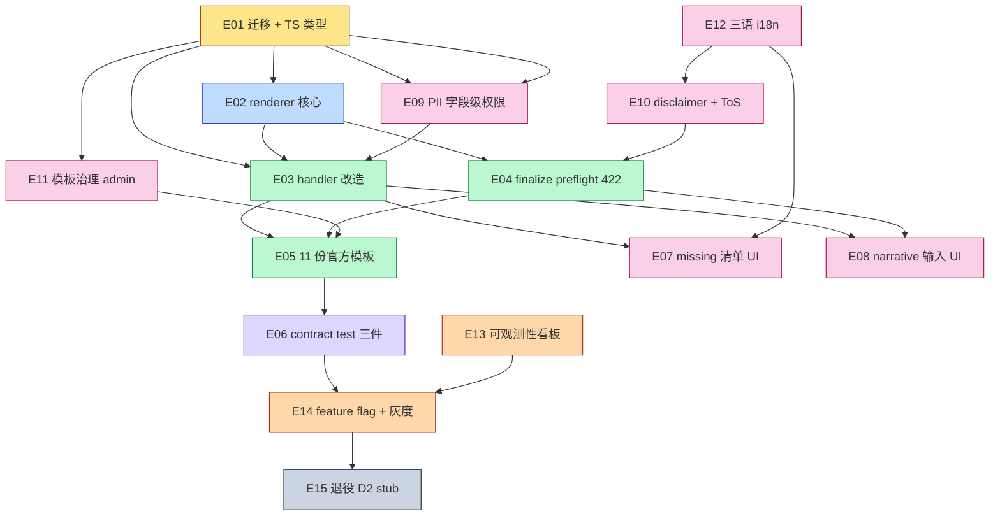

# D3 文書真实化渲染管线 — 顶层开发计划

- **Plan ID**: `d3-document-rendering-pipeline`
- **生成日期**: 2026-05-09
- **设计依据**: RFC-080 / SPEC-081 / SPEC-082 / AUDIT-083 / MCP-078
- **总 PR 估算**: 23 个（落在 18-28 区间）
- **总工时估算**: ~218 小时（≈ 5–7 周，单人节奏）

---

## 1. 背景与目标

D2 阶段已落地异步导出框架（队列 / handler / 状态机 / 5s 轮询），但 worker 内 `renderDocument` 仍是占位 stub —— 用户走完「新建 → 定稿 → 导出」链路，得到的 docx 内容空白只有标题。

**D3 目标**：把占位 stub 替换为可投产的真实文書渲染管线，让用户拿到内容非空白、可作为入管交付物使用的真实 docx 文書（申請理由書 / 委任状 / 身元保証書等）。同时：

1. 把「文書空白」的责任前移到 finalize 时刻（preflight 422）
2. 沉淀模板治理（生命周期 / 审核 / 灰度 / 退役）
3. 落地 PII 字段级权限 + 法律责任 disclaimer + 三语 i18n
4. 灰度 feature flag 上线 + 退役 D2 stub

---

## 2. 范围（包含 / 排除）

### 包含（P1）

- 11 份官方 DOCX 模板（common × 3 + dependent_visa × 2 + work × 3 + business_manager × 3）
- 模板生命周期状态机（draft / review / published / deprecated）
- 渲染管线（loadTemplate → buildContext → preflight → fillDocx → upload）
- finalize-time preflight + export-time preflight 复用同一函数
- 上下文聚合（customer / case / supporter / documents / org / today / narrative 七大块）
- PII 字段级权限（HIGH / MEDIUM / LOW）+ `users.can_view_high_pii`
- 法律责任 disclaimer 同意 UI + audit log
- `export_failure_reason` / `fill_rate` 可观测性
- 灰度 feature flag `GD_RENDER_PIPELINE_V3` + `rollout_org_ids`
- contract test 三件（必备矩阵覆盖率 / 模板占位 ⊆ schema / schema 字段 ⊆ Context Schema v1）

### 排除（明确不做）

- 申請書 PDF（入管定式）AcroForm 自动填表 → **P3 单独 RFC**
- 服务端 PDF 直出（docx → PDF）→ **P2 单独 RFC**
- 翻訳証明書（戸口本 / 出生 / 婚姻）→ **P2 单独 RFC**
- 報酬請求書 / 領収書 / 業務報告書 → **P2 单独 RFC**（インボイス制度対応）
- 印影 PNG 嵌入 → **P2**（P1 文字版 + 自行盖印兜底）
- 業務帳簿自動生成 → **P3 评估**
- 多语种自动翻译 → **P2**
- 在线模板编辑器 → **P2 评估**
- 会社設立 / 許認可 / 相続类 caseType → **P2 caseType 扩展**
- 事务所自定义模板上传 → **P2**

---

## 3. Epic 依赖图（mermaid）

### 硬依赖（must）

- E02 依赖 E01（需要新 schema 字段 + 类型）
- E03/E04 依赖 E02（renderer 必须存在）
- E05 依赖 E03（无 handler 真实化无法 e2e 验收）
- E06 依赖 E05（contract test 需要至少 1 份 published 模板做 fixture）
- E14 依赖 E06（contract 全绿才能开闸灰度）
- E15 依赖 E14（全量后 1 sprint 才能退役 stub）

### 软依赖（可并行）

- E07 / E08 / E12 都改 admin 但不冲突 → 同 sprint 并行
- E09 / E10 / E11 各自独立模块 → 可并行
- E13 与 E14 可并行（看板 vs flag）

---

## 4. 里程碑时间线

| 里程碑 | 主目标 | 包含 epic | 估时 | 验收信号 |
|---|---|---|---:|---|
| **M1** 数据骨架 | 迁移落地 + 类型扩展 | E01 | 12h（1 周内） | 6 条迁移 up/down 在 dev DB 往返通过；TS 编译绿 |
| **M2** 渲染核心 | renderer 单测全绿 | E02 | 24h（1-2 周） | mapper / preflight / fillDocx 单测覆盖率 ≥ 90% |
| **M3** 端到端 happy path | handler + finalize 接入 + 第 1 份模板跑通 | E03 / E04 / E05.T1 | 36h（2-3 周） | dev 环境 1 份家族滞在「申請理由書」从 finalize → export → 下载内容非空 |
| **M4** 模板齐全 + contract 全绿 | 11 份模板齐 + 三件 contract test | E05（剩余）/ E06 | 32h（3-4 周） | `npm run guard` contract test 全绿；admin 模板下拉露出 11 条 published |
| **M5** admin UX 完整 | missing 清单 / narrative / PII / disclaimer / 模板治理 / i18n | E07 / E08 / E09 / E10 / E11 / E12 | 90h（4-5 周） | admin 全链路可走通：finalize 422 → 跳转补字段 → 重新 finalize → export → 下载 |
| **M6** 灰度上线 | feature flag + 看板 | E13 / E14 | 20h（5-6 周） | `GD_RENDER_PIPELINE_V3` 在 staging 灰度 5% org 通过 1 sprint 监控 |
| **M7** 退役 D2 stub | 旧 stub 删除 + 历史记录 UX | E15 | 8h（6-7 周） | 旧 `renderDocument` stub 物理删除；`placeholder://` 死链历史记录显示「占位文件，请重新导出」 |

> **节奏假设**：单人 35h/周 投入；2 人并行可压缩到 4 周。

---

## 5. 风险登记表

| # | 风险 | 等级 | 触发条件 | 缓解措施 | 兜底方案 |
|---|---|:---:|---|---|---|
| **R1** | `docx-templates` v4 与 Node 22 兼容性问题 | High | E02 引入依赖时 binary 不兼容 / `createReport` 抛 native 异常 | 在 E02-T0 锁版本前先做 spike：用 fixture docx 跑 minimal call；如不通过降版到 v3 | 自实现 docxjs minimal placeholder fill（< 200 行），仅支持文本占位 |
| **R2** | RLS 透传到 renderer 失败 | High | mapper 直接用 pool 而非 tenantDb，跨 org 读到他人数据 | E02 强制约束：所有 loadXxx 函数签名第一参数必须是 `tenantDb`；contract test 验证 | 单测 fixture 注入 fake tenantDb 抛错路径 |
| **R3** | Redis 异常导致队列入队失败 | Medium | finalize 后 export 入队失败但 status 已推 `exporting` | E03 改造时复用 D2 已有的 `claimNextJob` PG fallback；监控 export_failed 中 reason=storage_upload_failed | 自动 cron 「exporting > 5min → export_failed」（D2 已有 `STALE_EXPORT_THRESHOLD_MINUTES`） |
| **R4** | 模板法律审核 SLA 拖延 | High | 11 份官方模板等法务签字 → 阻塞 M4 / M6 | E05-T0 提前给法务发审核 backlog（不等研发完工）；运营负责催；提前编辑共用 footer 文言 | 灰度先开 1-2 份模板（E14 rollout_org_ids 控制），其余批次跟上 |
| **R5** | 大文件 timeout（模板 + context > 10MB） | Medium | 经营管理类 narrative 字段 + 长 documents 数组导致 createReport 超过 120s | LRU 缓存模板 buffer + AbortController 软超时（D2 已有）；监控 `export_failure_reason='timeout'` 频率 | 把 timeout 异常分类为可重试，前端展示「重试」按钮 |
| **R6** | 中国系汉字混入风险（简繁体字进入入管文書） | High | 客户档案 `name_full_kanji` 录的是简体「刘」，模板渲染后入管收到简体 | preflight 派生 `customer.nameScript`；模板审核（82 §3.1）必查；E05-T0 文档化「漢字必须日漢字統一」 | E07 missing 清单 + admin 提示「检测到非日本漢字字符」 |
| **R7** | disclaimer 法律效力（用户不同意 vs 强制阻塞） | Medium | E10 同意 UI 拦截 finalize 但用户绕过（直接 curl API） | E04 server 侧强制：未同意 disclaimer → finalize 422 `disclaimer_required`；audit log 记录每次同意 | 法务再起草 ToS 第 X 条作为最终兜底 |
| **R8** | `fill_rate` 计算 corner case 误差 | Low | applicableWhen 命中但值为空 vs 未命中 vs required 缺失三种语义混淆 | E02-T2 单测穷举三种状态；分子 = 实际填值字段；分母 = required + applicable optional | 监控仅做 7 日 P50 趋势，不强制告警阈值 |
| **R9** | dev seed `ON CONFLICT DO NOTHING` 漂移（已知 NEW-V7-5） | Medium | 旧 dev DB 有 alias `family_stay` 模板，新 seed 不覆盖 | E05-T0 把 seed 改为 `ON CONFLICT (id) DO UPDATE SET ...`；E06 contract test 兜底 | dev README 提示「破坏性 reseed：先 `npm run db:reset`」 |
| **R10** | `applicableWhen` DSL 自实现 bug（嵌套括号 / 优先级） | Medium | 模板用了 `(a==1) && (b!=2 || c==3)` 渲染漏判 | E02-T2 限制 DSL 只支持 §8.2 EBNF 范围内（无括号嵌套）；超过即模板审核拒绝 | 短期降级：所有 schema 不允许 `applicableWhen` 跨 2 层 || 嵌套 |

---

## 6. 关键决策（已拍板）

| # | 决策 | 选择 | 备注 |
|---|---|---|---|
| B1 | P1 输出格式 | **仅 DOCX** | PDF 走 P2 |
| B2 | preflight 缺 required | **拦截定稿** | 422 |
| B3 | 事务所自上传模板 | **P1 不开放** | 平台运营 11 份打磨稳 |
| B4 | 资料附件内嵌 | **不内嵌** | 主文書 + 资料 ZIP 分离 |
| B5 | 模板生命周期 | **平台运营 + 法务季度** | 详见 SPEC-082 |
| D1 | 11 份模板内容产出 | **运营/法务负责 docx 内容**；研发负责 schema + storage 上传脚手架 | E05 标 `blocked_on=ops` |
| D2 | feature flag | `GD_RENDER_PIPELINE_V3` + `rollout_org_ids` 共存 | RFC-080 §10.1 |
| D3 | i18n 散落 vs 集中 | **集中到 E12 单独 PR** | 防 lint failure |
| D4 | E15 退役时机 | rollout 全量后 1 sprint 才退役 stub | 保留兜底 |
| D5 | 集成测试 storage | local provider + tmp 目录 | 不接 S3 |

---

## 7. 守门规约（每个 epic 验收必含）

来自 [`AGENTS.md`](../../../AGENTS.md) 与 [`/Users/ck/workplace/cms-client/.cursor/rules/core-operating-rule.mdc`](../../../.cursor/rules/core-operating-rule.mdc)：

- [ ] `npm run fix` 通过
- [ ] `npm run guard` 通过
- [ ] 新增逻辑有单测覆盖（model / domain / data 优先）
- [ ] 不引入新依赖（除 `docx-templates`）
- [ ] 测试不发起真实网络
- [ ] feature 不直接 import data / infra / tamagui
- [ ] 单文件 ≤ 500 行
- [ ] 不引入 secret / token / key

---

## 8. 不在 P1 范围（再次明确）

- 申請書 PDF（入管定式）AcroForm 自动填表 → **P3 单独 RFC**
- 服务端 PDF 直出（docx → PDF）→ **P2 单独 RFC**
- 翻訳証明書（戸口本 / 出生 / 婚姻）→ **P2 单独 RFC**
- 報酬請求書 / 領収書 / 業務報告書 → **P2 单独 RFC**（インボイス制度対応）
- 印影 PNG 嵌入 → **P2**（P1 文字版 + 自行盖印兜底）
- 業務帳簿自動生成 → **P3 评估**
- 多语种自动翻译 → **P2**
- 在线模板编辑器 → **P2 评估**
- 会社設立 / 許認可 / 相続类 caseType → **P2 caseType 扩展**
- 事务所自定义模板上传 → **P2**

---

## 9. 出口标准（M7 完成视为 D3 阶段终结）

- [ ] D2 占位 stub 已删除（grep `buildMinimalDocx` / `buildMinimalPdf` 0 命中）
- [ ] feature flag `GD_RENDER_PIPELINE_V3` `rollout_org_ids = null`（全量）
- [ ] 11 份官方模板 100% `publish_state='published'` + contract test 全绿
- [ ] 7 日 P50 fill_rate ≥ 95%
- [ ] 7 日 export_failure_reason 分布无 `template_render_error` 突增
- [ ] admin 三语 i18n 无 `cases.detail.forms.*` 漏 key
- [ ] disclaimer 同意覆盖率 100%（首次使用强拦截）
- [ ] 历史 `placeholder://` 死链记录全部展示「占位文件 · 请重新导出」徽章
