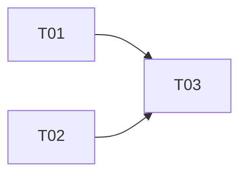

# Epic README 模板

> 用于 `docs/plans/<plan-id>/epics/E<NN>/README.md`。
> 由本 skill 在 **agent 模式**落盘；plan 模式仅在 chat 内以"Epic 总览表"形式预览（详见 SKILL.md § Deliverables.A.2）。
> 一个 Epic = 一个可独立验收的业务能力切片。

```markdown
# E<NN> <Epic Title>

## 1. Epic 目标
- 用一句话说明本 Epic 完成后用户/系统能做到什么。
- 给出可观测的成功指标（页面行为、接口契约、状态机、数据迁移结果等）。

## 2. 范围与非范围
### 范围
- <在范围内的能力 1>
- <在范围内的能力 2>

### 非范围
- <明确不做的事 1>
- <明确不做的事 2>

## 3. 涉及 workspace 与模块
| Workspace | 主要目录 | 备注 |
|-----------|----------|------|
| @cms/admin | packages/admin/src/views/<...> | <...> |
| server | packages/server/src/modules/<...> | <...> |
| mobile | packages/mobile/src/features/<...> | <...> |

## 4. 原子任务清单
| Task ID | 标题 | Workspace | depends_on | 并行组 |
|---------|------|-----------|------------|--------|
| T01 | <slug> | @cms/admin | - | groupA |
| T02 | <slug> | server | - | groupA |
| T03 | <slug> | @cms/admin | T01 | groupB |

任务文档：
- [T01-<slug>](tasks/T01-<slug>.md)
- [T02-<slug>](tasks/T02-<slug>.md)
- [T03-<slug>](tasks/T03-<slug>.md)

## 5. 任务依赖图


## 6. Epic 级验收标准
- [ ] <可客观判定的验收项 1>
- [ ] <可客观判定的验收项 2>
- [ ] 所有原子任务的 `per_task_checks` 全绿
- [ ] 等待最终全量回归（`npm run fix` + `npm run guard`）通过后才算交付

## 7. 已知风险
- <风险 1：触发条件 / 影响 / 缓解>
- <风险 2：触发条件 / 影响 / 缓解>
```

## 填写要点

- 每个 Epic 必须能在不依赖其它 Epic 的情况下独立回滚（必要时用 feature flag 隔离）。
- "原子任务清单" 表格的字段必须与 `manifest.json` 中对应任务条目一致；改动其一必须同步另一。
- 不要在 Epic README 里写 ts/lint 命令；那是任务文档的职责。
