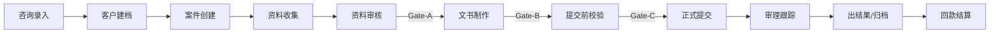

# 02 产品全景图（P0 首版）

> 本文用一页串联 P0 首版的案件主链路，帮助读者快速建立端到端认知。
> 完整的全量业务流程见主目录 [02-产品全景图](../02-产品全景图.md)。

## 这份文档适合谁看

- 需要快速了解 P0 首版覆盖哪些环节的研发、设计、QA
- 需要理解"首版到底跑什么链路"的试点客户或外部顾问

## 阅读这篇后你会知道什么

- P0 主链路从头到尾有哪些环节
- 每个环节做什么、P0 做到什么程度
- 三道门槛（Gate）在哪里触发

---

## P0 主链路



---

## 各环节 P0 说明

| # | 环节 | P0 做什么 | P0 不做什么 |
|---|------|----------|-----------|
| 1 | 咨询录入 | 新建线索，记录联系方式/来源/意向类型；线索状态流转 | 外部渠道自动采集（LINE/网站表单） |
| 2 | 客户建档 | 线索转个人客户，基础字段，关联人关系，去重提示 | 企业客户主数据、批量导入 |
| 3 | 案件创建 | 选模板建案（家族滞在/技人国），自动生成资料清单；家族签支持批量建案 | 自定义模板、复杂案件类型 |
| 4 | 资料收集 | 按清单追踪资料状态，附件版本上传，标记提供方 | 客户门户自助上传 |
| 5 | 资料审核 | 内部审核通过/退回，缺件催办留痕 | 自动化催办（定时任务触发） |
| 6 | 文书制作 | 模板变量填充，生成委任状/理由书等，导出 Word/PDF | 文书版本管理（初稿/审核版/定稿流程） |
| 7 | 提交前校验 | 硬性阻断项校验（最小集合），校验报告展示 | 高级校验规则配置化、双人复核默认强制 |
| 8 | 正式提交 | 生成提交包，锁定引用版本，记录回执 | — |
| 9 | 审理跟踪 | 记录进度更新、补正通知 | 与入管系统的自动对接 |
| 10 | 出结果/归档 | 记录审查结果，案件归档 | — |
| 11 | 回款结算 | 收费节点、回款记录、欠款标记与风险提示 | 欠款作为统一提交硬阻断 |

**贯穿全链路的能力**：
- 期限提醒（在留到期、补件截止、提交截止）
- 审计日志（关键操作留痕）
- 工作台聚合（待办/到期/逾期/风险）

---

## 三道门槛（Gate）在 P0 中的作用

| 门槛 | 触发位置 | P0 检查内容 |
|------|---------|-----------|
| **Gate-A** | 资料审核→文书制作 | 关键资料项已通过审核 |
| **Gate-B** | 文书制作→提交前校验 | 文书已定稿、CaseParty 齐备 |
| **Gate-C** | 提交/生成提交包前 | 最终校验通过，生成不可变快照 |

校验结果分为**硬性阻断**（必须修复）和**软性提示**（风险提示，不阻断流转）。P0 硬性阻断项为最小集合，详见 [03-业务规则与不变量](03-业务规则与不变量.md)（待建）。

---

## P0 核心对象关系

```
Customer ──建案──→ Case ──── CaseParty（关联人）
                     │
              ┌──────┼───────────────┐
              │      │               │
      DocumentRequirement    BillingPlan（收费节点）
      (资料项)                       │
              │                PaymentRecord
      DocumentFileVersion    (回款记录)
      (附件版本)
              │
      SubmissionPackage ←── GeneratedDocumentVersion
      (提交包·不可变)        (文书版本)
```

对象的详细语义见主目录 [08-术语表](../08-术语表.md)。
