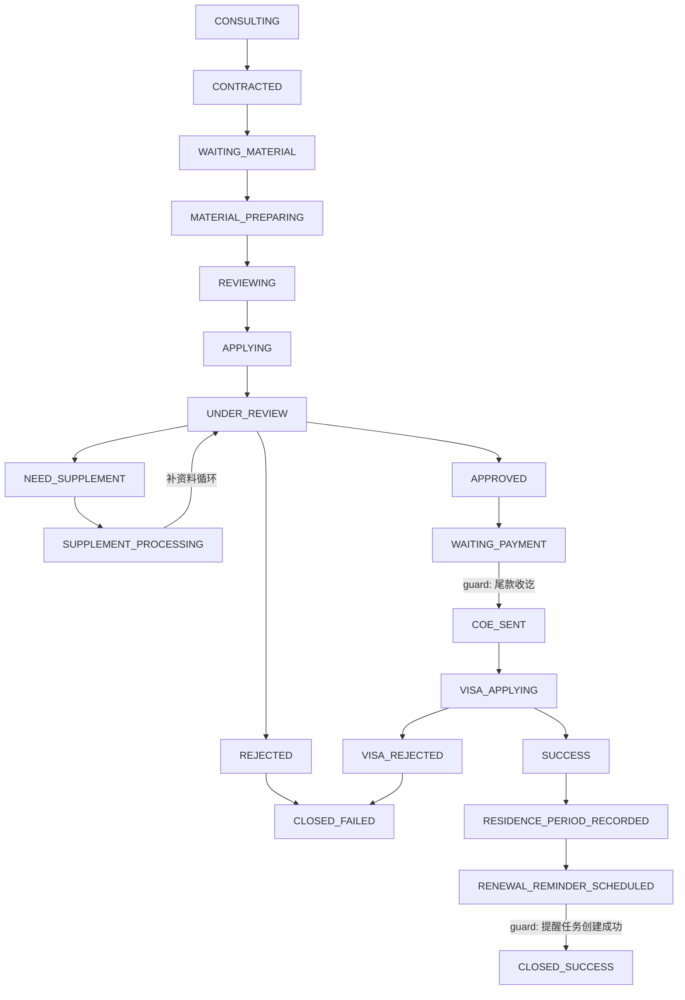

# 10 双层状态机映射

> 生成日期：2026-04-28
> 权威实现：`packages/server/src/modules/core/cases/businessPhase.ts`
> 关联计划：`.cursor/plans/p0+p1_事务所流程驱动_bug_修复（修订版）_1c92a793.plan.md` §3
> 业务基线：`docs/事务所流程/新规経営管理签申请全套流程Markdown文档.md` + `docs/事务所流程/事務所流程.master.json`

---

## 1. 概述

案件状态由两个正交维度共同表达：

| 维度 | 字段 | 值域 | 用途 |
|---|---|---|---|
| 操作维度 | `Case.stage` | S1-S9（9 个） | Gate/SLA/报表/操作步骤推进 |
| 业务维度 | `Case.business_phase` | 20 个枚举值 | 业务语义阶段、客户可见状态、phase 筛选 |

两者独立推进：stage transition 通过 `POST /:id/transition`，phase transition 通过 `POST /:id/phase-transition`。`stageToPhaseDefault` 仅用于旧数据迁移回填。

---

## 2. businessPhase 20 状态枚举

| # | ID | 中文名称 | 终态 |
|---|---|---|---|
| 1 | `CONSULTING` | 咨询阶段 | 否 |
| 2 | `CONTRACTED` | 已签约 | 否 |
| 3 | `WAITING_MATERIAL` | 等待客户提交资料 | 否 |
| 4 | `MATERIAL_PREPARING` | 内部制作资料中 | 否 |
| 5 | `REVIEWING` | 内部/客户确认中 | 否 |
| 6 | `APPLYING` | 已提交入管 | 否 |
| 7 | `UNDER_REVIEW` | 入管审查中 | 否 |
| 8 | `NEED_SUPPLEMENT` | 入管要求补资料 | 否 |
| 9 | `SUPPLEMENT_PROCESSING` | 补资料处理中 | 否 |
| 10 | `APPROVED` | 下签（COE） | 否 |
| 11 | `REJECTED` | 入管拒签 | 否 |
| 12 | `WAITING_PAYMENT` | 待收尾款 | 否 |
| 13 | `COE_SENT` | 已发送 COE | 否 |
| 14 | `VISA_APPLYING` | 客户海外返签中 | 否 |
| 15 | `SUCCESS` | 客户已成功入境 | 否 |
| 16 | `VISA_REJECTED` | 海外返签拒签 | 否 |
| 17 | `RESIDENCE_PERIOD_RECORDED` | 已记录新在留有效期间 | 否 |
| 18 | `RENEWAL_REMINDER_SCHEDULED` | 已设置到期提醒 | 否 |
| 19 | `CLOSED_SUCCESS` | 成功结案 | **是** |
| 20 | `CLOSED_FAILED` | 失败结案 | **是** |

---

## 3. Phase 转换图

### 3.1 转换表（代码级）

| from | allowed to |
|---|---|
| `CONSULTING` | `CONTRACTED` |
| `CONTRACTED` | `WAITING_MATERIAL` |
| `WAITING_MATERIAL` | `MATERIAL_PREPARING` |
| `MATERIAL_PREPARING` | `REVIEWING` |
| `REVIEWING` | `APPLYING` |
| `APPLYING` | `UNDER_REVIEW` |
| `UNDER_REVIEW` | `APPROVED`, `REJECTED`, `NEED_SUPPLEMENT` |
| `NEED_SUPPLEMENT` | `SUPPLEMENT_PROCESSING` |
| `SUPPLEMENT_PROCESSING` | `UNDER_REVIEW` |
| `APPROVED` | `WAITING_PAYMENT` |
| `REJECTED` | `CLOSED_FAILED` |
| `WAITING_PAYMENT` | `COE_SENT` |
| `COE_SENT` | `VISA_APPLYING` |
| `VISA_APPLYING` | `SUCCESS`, `VISA_REJECTED` |
| `SUCCESS` | `RESIDENCE_PERIOD_RECORDED` |
| `VISA_REJECTED` | `CLOSED_FAILED` |
| `RESIDENCE_PERIOD_RECORDED` | `RENEWAL_REMINDER_SCHEDULED` |
| `RENEWAL_REMINDER_SCHEDULED` | `CLOSED_SUCCESS` |
| `CLOSED_SUCCESS` | _(终态，不允许再流转)_ |
| `CLOSED_FAILED` | _(终态，不允许再流转)_ |

---

## 4. Gate 条件

### 4.1 进入 CLOSED_SUCCESS 的 gate

必须同时满足：

1. **入境成功**：案件已通过 `VISA_APPLYING → SUCCESS` 路径确认客户入境
2. **已录入在留期间**：`ResidencePeriod` 记录已创建（`residence_period_start_date` / `residence_period_end_date` / `residence_years` / `entry_date`），案件已处于 `RESIDENCE_PERIOD_RECORDED`
3. **已生成续签提醒**：系统已自动创建 180/90/30 天到期提醒任务，案件已处于 `RENEWAL_REMINDER_SCHEDULED`
4. **提醒创建失败时禁止结案**：若提醒任务创建失败，案件不得进入 `CLOSED_SUCCESS`，应进入人工待处理队列

### 4.2 进入 CLOSED_FAILED 的 gate

- 必须填写 `closeReason`
- 允许进入的前置状态：`REJECTED`（入管拒签）或 `VISA_REJECTED`（海外返签拒签）

### 4.3 进入 COE_SENT 的 gate

- 尾款收讫守卫：先查 `Case.final_payment_paid_cached`（快速判断），最终以 `BillingPlan` 结果后节点状态为准
- 未结清时 warn 模式（风险确认留痕后可继续）

### 4.4 补资料循环 gate

- `UNDER_REVIEW → NEED_SUPPLEMENT → SUPPLEMENT_PROCESSING → UNDER_REVIEW` 可多次循环
- 循环次数由 `Case.supplement_count_cached` 统计（缓存值，真相源为 SubmissionPackage 数量）
- 补资料期间案件保持在补资料路径，不回退到提交前阶段

### 4.5 终态不可变

- `CLOSED_SUCCESS` / `CLOSED_FAILED` 为终态，不允许任何后续流转
- `assertPhaseTransition()` 会对终态抛出 `PhaseTransitionError`

---

## 5. Stage → Phase 默认映射（迁移回填用）

> 仅用于旧数据迁移回填。新建 case 在 service 层根据实际动作写入精确的 phase，前端不做 fallback。

| Stage | Stage 说明 | 默认 businessPhase | 映射理由 |
|---|---|---|---|
| S1 | 已建档 | `CONSULTING` | 案件刚建档，处于咨询→签约前 |
| S2 | 资料收集中 | `WAITING_MATERIAL` | 签约后向客户收集资料 |
| S3 | 资料审核中 | `MATERIAL_PREPARING` | 内部审核/制作资料阶段 |
| S4 | 文书制作中 | `REVIEWING` | 行政书士处理 + 确认流程 |
| S5 | 待校验 | `APPLYING` | 准备提交入管 |
| S6 | 待提交 | `APPROVED` | 默认走 happy path |
| S7 | 已提交审理中 | `WAITING_PAYMENT` | 默认走 happy path（已过审查） |
| S8 | 已出结果 | `SUCCESS` | 默认走 happy path；REJECTED 由显式 transition 覆盖 |
| S9 | 已归档 | `CLOSED_SUCCESS` | 默认走成功结案；CLOSED_FAILED 由 closeReason 路径覆盖 |

**注意事项**：
- S6→`APPROVED` / S7→`WAITING_PAYMENT` / S8→`SUCCESS`：旧数据未记录具体结果时，默认取 happy path。若实际为拒签或失败结案，需后续人工或脚本修正。
- 该映射在 `businessPhase.ts` 的 `STAGE_TO_PHASE_DEFAULT` 常量中实现。

---

## 6. Stage transition 收紧

本轮同步收紧了 `DEFAULT_CASE_TRANSITIONS`（S1-S9 操作维度）：

- **移除**：S1~S6 → S9 的"任意路径提前归档"边
- **S9 仅允许**从 S8 进入，或通过显式 closeReason 路径
- **业务约束**："未提交入管不得归档"

---

## 7. 代码位置速查

| 文件 | 内容 |
|---|---|
| `packages/server/src/modules/core/cases/businessPhase.ts` | phase 枚举、转换图、stageToPhaseDefault、assertPhaseTransition、isTerminalPhase |
| `packages/server/src/modules/core/cases/cases.service.ts` | create/transition 同步推进 phase；transitionPhase()；DEFAULT_CASE_TRANSITIONS 收紧 |
| `packages/server/src/modules/core/cases/cases.controller.ts` | `POST /:id/phase-transition` 端点；list query `?phase=` |
| `packages/server/src/infra/db/drizzle/schema.ts` | `cases.business_phase text NOT NULL` |
| `packages/admin/src/views/cases/constants.ts` | 前端 BUSINESS_PHASES + getPhaseLabel |
| `packages/admin/src/views/cases/components/CaseTableRow.vue` | phase badge 展示 |

---

## 8. 下一轮入口

| 待做事项 | 说明 | 优先级 |
|---|---|---|
| 列表 phase 筛选 UI | 后端已支持 `?phase=` 参数，前端筛选器待实现 | P2 |
| Document Center 接真实 API | 从 fixture 切到 `/api/document-items` | P2 |
| checklist item i18n 迁移 | 当前 item label 用 `{ zh, en, ja }` 内嵌，后续迁到 `/api/case-templates` | P2 |
| P0/03 §3.0F 回灌 | 追加 businessPhase 20 状态 + stageToPhaseDefault 映射表 | 下一轮优先 |
| P0/07 §双层状态模型回灌 | 追加 business_phase 字段定义与迁移回填规则 | 下一轮优先 |
| NEED_SUPPLEMENT 循环端到端验证 | 多次循环 + supplement_count + 资料模板挂回 | 下一轮 |
| CLOSED_FAILED 路径端到端验证 | 拒签 → closeReason → 退款路径 | 下一轮 |
