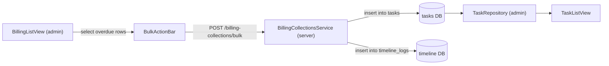

# 收费催款链路走查与优化清单（第一轮）

> 生成日期：2026-05-02
>
> 走查依据：
> - 收费催款流程优化计划（`收费催款流程优化计划_0629c514.plan.md`）
> - `docs/gyoseishoshi_saas_md/_output/30-双层状态机自动化复盘走查Bug清单-第二十一轮.md` R21 走查结论
>
> 走查范围：
> - admin `BillingListView` → `BulkActionBar` → server `BillingCollectionsService` → `tasks` DB + `timeline_logs` DB → admin `TaskRepository` → `TaskListView` 全链路
>
> 走查环境：admin `:5173`（vite 反代 `/api` → `:3300`）、server NestJS `:3300`、PostgreSQL `cms-client-postgres-1` `:5433`

---

## 0. 总结

### 0.1 链路全景



### 0.2 一句话结论

**主链路正确**（成功 / 跳过 / 时间线均按设计落地），需要修复 3 处旁路缺陷。

### 0.3 三处缺陷概览

| # | 一句话 | 等级 | 影响范围 | 根因 |
|---|--------|------|----------|------|
| D-1 | tasks 列表缺案件名 / 责任人姓名 | 中 | server + admin | `list()` SQL 未 join `cases` / `users`，前端只能展示 ID |
| D-2 | 收费列表 `due_date` 在非 JST 浏览器偏 1 天 | 中 | admin | `new Date('2026-04-15')` 被解析为 UTC 0 点，`toLocaleDateString('ja-JP')` 在 UTC 环境回退一天 |
| D-3 | 无逾期节点时批量催款入口无空态提示 | 低 | admin | `BulkActionBar` 在 `selectedCount === 0` 时整体隐藏，用户不理解 checkbox 全灰 |

---

## 1. 入口路径与通过项

### 1.1 主链路入口

| 步骤 | 页面 / 接口 | 操作 |
|------|-------------|------|
| 1 | `/#/billing` BillingListView | 勾选逾期行 → 点击批量催款 |
| 2 | `POST /billing-collections/bulk` | 服务端批量创建催款任务 + 写时间线 |
| 3 | `/#/tasks` TaskListView | 查看生成的催款任务 |

### 1.2 通过项

| # | 验证点 | 结果 |
|---|--------|------|
| P-1 | 批量催款接口正确 insert `tasks` 表 | ✅ PASS |
| P-2 | 批量催款接口正确 insert `timeline_logs` 表 | ✅ PASS |
| P-3 | 已催款节点再次批量催款被正确跳过（幂等） | ✅ PASS |
| P-4 | 催款成功后 BillingListView 列表刷新 | ✅ PASS |
| P-5 | 催款任务在 TaskListView 列表出现 | ✅ PASS |
| P-6 | 催款时间线在案件详情时间线 tab 出现 | ✅ PASS |

---

## 2. 缺陷详情与修复方案

### 2.1 D-1：tasks 列表缺案件名 / 责任人姓名

#### 复现

催款成功后进入 `/#/tasks`，任务行只能看到 `caseId`（UUID）和 `assigneeUserId`（UUID），无法判断"这条催款催的是哪个案件、谁负责"。

#### 根因

服务端 `TasksService.list()` 使用 `TASK_COLS` 只查 `tasks` 本表字段，未 join `cases` / `users` 获取显示名。

#### 修复方案

**服务端** `packages/server/src/modules/core/tasks/tasks.service.ts`：

- 新增 `TASK_LIST_COLS`：在原 `TASK_COLS` 基础上 `LEFT JOIN cases c ON c.id = tasks.case_id`、`LEFT JOIN users u ON u.id = tasks.assignee_user_id`，挑出 `c.case_no`, `c.case_name`, `u.name AS assignee_name`
- `list()` 方法改用 `TASK_LIST_COLS`；`get()` / `update()` / `complete()` 保持 `TASK_COLS` 不变（单笔写后只需基础字段）
- 新增 `mapTaskListRow(row)` 返回 `Task & { caseNo, caseName, assigneeName }`

**服务端测试** `tasks.service.test.ts`：

- 新增 list-shape 测试，断言 SQL 包含 `LEFT JOIN cases`、`LEFT JOIN users`
- mock pool 返回带 `case_no / case_name / assignee_name` 的行，验证 mapper 输出

**客户端** `packages/admin/src/views/tasks/types.ts`：

- `TaskRecord` 增 `caseNo: string | null`、`caseName: string | null`、`assigneeName: string | null`

**客户端** `packages/admin/src/views/tasks/model/TaskRepository.ts`：

- `adaptTask` 读取三个新字段

**客户端** `packages/admin/src/views/tasks/TaskListView.vue`：

```vue
<td>
  <div class="cell-stack">
    <strong>{{ task.caseName || task.caseNo || t("tasks.workbench.placeholder") }}</strong>
    <span class="cell-meta">{{ task.assigneeName || t("tasks.workbench.taskTable.unassigned") }}</span>
  </div>
</td>
```

**客户端测试** `TaskRepository.test.ts`：mapper 字段测试。

#### 测试矩阵

| 场景 | 期望 |
|------|------|
| task 有 case_id + assignee_user_id | 列表显示案件名 + 担当者姓名 |
| task 有 case_id、无 assignee_user_id | 显示案件名 + "未分配" |
| task 无 case_id | 显示占位符 |
| SQL mock 行含三个 join 字段 | mapper 正确映射为 camelCase |

---

### 2.2 D-2：收费列表 `due_date` 在非 JST 浏览器偏 1 天

#### 复现

在 UTC 时区浏览器（headless Chrome 默认）下，`due_date = '2026-04-15'` 显示为 `2026/4/14`（少 1 天）。

#### 根因

`new Date('2026-04-15')` 被解析为 UTC 00:00，`toLocaleDateString('ja-JP')` 在 UTC 环境下回退一天（UTC 00:00 = JST 09:00 的前一天在负时区环境下更明显）。

#### 修复方案

**客户端** `packages/admin/src/views/billing/model/BillingDateHelpers.ts`：

`formatDueDate` 改为按 `YYYY-MM-DD` 字面量切分后拼装：

```typescript
export function formatDueDate(dueDate: string | null): string {
  if (!dueDate) return "";
  const parts = dueDate.slice(0, 10).split("-");
  if (parts.length !== 3) return "";
  const [y, m, d] = parts;
  const year = Number(y);
  const month = Number(m);
  const day = Number(d);
  if (!year || !month || !day) return "";
  return `${year}/${month}/${day}`;
}
```

`computeOverdueDays` 改为 UTC 锚点：

```typescript
export function computeOverdueDays(dueDate: string | null): number | undefined {
  if (!dueDate) return undefined;
  const parts = dueDate.slice(0, 10).split("-");
  if (parts.length !== 3) return undefined;
  const [y, m, d] = parts.map(Number);
  if (!y || !m || !d) return undefined;
  const dueUtc = Date.UTC(y, m - 1, d);
  const now = new Date();
  const todayUtc = Date.UTC(now.getUTCFullYear(), now.getUTCMonth(), now.getUTCDate());
  const diff = Math.floor((todayUtc - dueUtc) / 86_400_000);
  return diff > 0 ? diff : undefined;
}
```

**测试** `BillingAdapters.dueDate-tz.test.ts`：

- `formatDueDate('2026-04-15') === '2026/4/15'`
- `computeOverdueDays('2026-04-15')` 在固定 today 下结果与 JST 一致
- 在 `process.env.TZ='America/Los_Angeles'` 下断言不偏移

#### 测试矩阵

| 场景 | 期望 |
|------|------|
| `formatDueDate('2026-04-15')` | `'2026/4/15'` |
| `formatDueDate('2026-12-01')` | `'2026/12/1'` |
| `formatDueDate(null)` | `''` |
| `computeOverdueDays('2026-04-15')` (today=2026-04-17) | `2` |
| `computeOverdueDays('2026-04-15')` (today=2026-04-15) | `undefined` |
| 非 JST 时区（America/Los_Angeles）下结果不偏移 | 与 UTC 结果一致 |

---

### 2.3 D-3：无逾期节点时批量催款入口无空态提示

#### 复现

收费列表全部节点处于 `paid` / `outstanding`（非 overdue）时，全部 checkbox 灰色不可勾选，`BulkActionBar` 整体隐藏，用户看不出原因。

#### 根因

`BulkActionBar` 仅在 `selectedCount > 0` 时渲染，缺少 `selectableCount === 0` 时的空态提示分支。

#### 修复方案

**客户端** `packages/admin/src/views/billing/components/BillingTable.vue`：

表头工具区增加常驻提示节点：

```vue
<span
  v-if="rows.length > 0 && selectableCount === 0"
  class="bulk-empty-hint"
  role="note"
>
  {{ t("billing.list.bulk.emptyHint") }}
</span>
```

select-all checkbox 不可选时加 tooltip 兜底：

```vue
:title="selectableCount === 0 ? t('billing.list.bulk.emptyHint') : undefined"
```

`selectableCount` 由 props 从 `BillingListView.vue` 传入（来自 `useBillingSelection.selectableRows(rows).length`）。

**三语 i18n** `billing.list.bulk.emptyHint`：

| locale | 文案 |
|--------|------|
| zh-CN | `当前没有逾期节点，无法发起批量催款` |
| ja-JP | `現在、延滞中の収費ノードがないため、一括催促はできません` |
| en-US | `No overdue billing nodes — bulk collection is unavailable` |

**测试** `BillingTable.empty-hint.test.ts`：

- 传入 6 行非逾期数据，断言提示节点出现并带文案

#### 测试矩阵

| 场景 | 期望 |
|------|------|
| 6 行非逾期 rows，`selectableCount=0` | 空态提示可见 |
| 3 行逾期 rows，`selectableCount=3` | 空态提示不可见 |
| 0 行 rows | 空态提示不可见（走空表态） |

---

## 3. 数据回滚 SQL 留底

当本轮修复上线后需要回滚时，以下 SQL 可用于清理走查 / 测试产生的催款数据。

```sql
-- ⚠️ 仅用于开发 / 测试环境回滚，请勿在生产环境直接执行

-- 1. 删除走查期间由批量催款产生的 tasks（source_type='billing_collection'）
DELETE FROM tasks
WHERE source_type = 'billing_collection'
  AND created_at >= '2026-05-02 00:00:00+09';

-- 2. 删除对应的时间线日志
DELETE FROM timeline_logs
WHERE event_type = 'billing_collection_sent'
  AND created_at >= '2026-05-02 00:00:00+09';

-- 3. 验证清理结果
SELECT COUNT(*) AS remaining_tasks
FROM tasks
WHERE source_type = 'billing_collection'
  AND created_at >= '2026-05-02 00:00:00+09';

SELECT COUNT(*) AS remaining_logs
FROM timeline_logs
WHERE event_type = 'billing_collection_sent'
  AND created_at >= '2026-05-02 00:00:00+09';
```

---

## 4. 不在本轮范围

- 任务列表交互重构（仅做最小可读性补丁，不动 priority chip 配色等 UI 视觉规范）
- 后端 tasks list 的分页 / 筛选扩展
- billing 时间线展示页（与本走查无关）
- `BillingCollectionsService` 服务端逻辑不调整（链路本身已正确）

---

## 5. 交付门禁

- 三处缺陷各自独立可测试，改动范围内补单测
- 收尾顺序：`npm run fix` → `npm run guard`
- 不改 `package-lock.json`，不引入新依赖
- 不动 `domain` / `data` / `infra` 之间的边界（仅在 `model` 层与 `views/components` 层动）

---

走查方完成。
