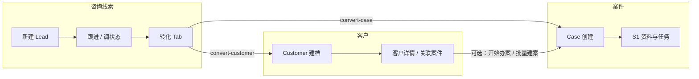

# 咨询 → 客户 → 案件 全流程分析与 Chrome DevTools MCP 测试手册

> **用途**：为使用 **Chrome DevTools MCP** 做端到端走查时提供「流程真相源 + 路由/API 映射 + 分场景断言清单」。  
> **日期**：2026-05-11  
> **权威业务引用**（不得与之矛盾）：  
> - [P0/04-核心流程与状态流转.md](../P0/04-核心流程与状态流转.md)（主链路、§4.1 咨询转案件）  
> - [P0/06-页面规格/咨询线索.md](../P0/06-页面规格/咨询线索.md)（Lead 页面动作、§4 转客户/转案件）  
> - [ADR-admin-convert-split.md](./ADR-admin-convert-split.md)（Admin：`convert-customer` 与 `convert-case` **拆两步**）

**代码契约入口**（排障时优先对照实现，而非凭记忆猜 URL）：

- 线索 API 基路径：`packages/admin/src/views/leads/model/LeadRepositorySupport.ts`（默认 `/api/admin/leads`）  
- 路径拼装：`LeadAdapterWriteBuilders.ts`（`buildLeadStatusPath`、`buildLeadConvertCasePath` 等）  
- 详情 Tab / 按钮门禁：`types-detail.ts`（`LEAD_DETAIL_TABS`、`HEADER_BUTTON_PRESETS`）  
- 会话恢复：`shared/navigation/sessionResumeKeys.ts`、`customers/model/useResumeLeadCaseCreateBanner.ts`

---

## 1. 流程总览（咨询签约前 → 建档建案）

### 1.1 概念链路

```text
咨询线索 Lead（签约前）
    → 状态推进（new → following → pending_sign → signed）
    → 转客户 Customer（POST convert-customer，回填 converted_customer_id）
    → 转案件 Case（POST convert-case，回填 converted_case_id，线索 status → converted_case）
    → 案件管理层阶段 S1（新建案件默认「刚开始办案 / S1」，详见 04 §0.2）
```

### 1.2 与 Portal 的差异（测试时注意）

| 端 | 转化模式 | 说明 |
|----|----------|------|
| **Admin** | 两步：`convert-customer` → `convert-case` | 对齐规格「转客户」「转案件」为独立动作；见 ADR |
| **Portal**（若对比） | 一步合并 convert | 不在本手册展开；勿与 Admin 断言混用 |

### 1.3 端到端泳道（Mermaid）



### 1.4 产品入口（与 MCP 起点）

除左侧导航外，下列入口应纳入「同一流程、不同起点」的覆盖：

| 入口 | 路由 / 行为 | 说明 |
|------|-------------|------|
| 仪表盘快捷「新建咨询线索」 | 先 `push` `#/leads?action=new`，列表挂载后 **`replace` 清除 `action`** | `QuickActionsPanel.vue` → `name: leads, query: action=new`；稳定态地址为 **`#/leads`**（无 query），新建弹窗保持打开（见 `leadCreateEntry.ts`） |
| 顶部栏新建线索 | `#/leads?action=new` | `TopBar.vue` |
| 仪表盘快捷「新建客户」 | `#/customers?action=new`（或 `#new`） | `CustomerListView` 打开新建客户流程 |
| 仪表盘快捷「新建案件」 | `#/cases/create` | 无客户上下文时的空白建案起点 |

---

## 2. Admin 前端路由（Hash）

Admin 使用 `createWebHashHistory()`，路径形如 `https://<host>/#/leads`、`#/customers/:id`。

| 模块 | 路由 path | route name | 说明 |
|------|-----------|--------------|------|
| 仪表盘 | `#/` | `dashboard` | 快捷操作：线索 / 客户 / 案件新建 |
| 咨询列表 | `#/leads` | `leads` | 支持 `?action=new` 弹窗新建 |
| 咨询详情 | `#/leads/:id` | `lead-detail` | 见下表「Tab query」 |
| 客户列表 | `#/customers` | `customers` | 支持 `?action=new` |
| 客户详情 | `#/customers/:id` | `customer-detail` | 「开始办案」「批量建案」、BMV 卡片（若有） |
| 案件列表 | `#/cases` | `cases` | |
| **案件新建** | `#/cases/create` | `case-create` | query + 可选 **`#family-bulk`**（家族批量） |
| 案件详情 | `#/cases/:id` | `case-detail` | 概览、资料、任务、文书等 |

### 2.1 线索详情 Tab 与 `?tab=` 合法值

仅当 `tab` 为下列之一时才会同步到 UI（否则回落到「基础信息」）：

| `tab` 值 | 面板 |
|----------|------|
| `info` | 基础信息（默认；此时通常会从 URL **省略** tab） |
| `followups` | 跟进记录 |
| `conversations` | 会话（规格与实现对照见 §3.6） |
| `conversion` | 转化信息 |
| `log` | 日志 |

**Lead 详情深度链接（便于 MCP 复现转化弹窗）**

- `?tab=conversion`：打开「转化信息」Tab  
- `?tab=conversion&resumeConvert=1`：进入转化 Tab 后自动拉起转案件弹窗；随后应从 query **移除** `resumeConvert`（`LeadDetailView.vue`）  
- 「客户页横幅 → 继续转案件」使用 **`window.location.hash`** 写入完整 `#/leads/:id?...`（`useResumeLeadCaseCreateBanner.ts`），MCP 需观察 **整页 hash 变化**，而非仅 `router.push` query

### 2.2 Admin 线索 API 速查（相对 `/api`）

前缀以运行时为准（一般为 **`/api/admin/leads`**）。下列方法与 `LeadRepository` 一致：

| 方法 | 路径模式 | 用途 |
|------|-----------|------|
| GET | `/admin/leads` | 列表（筛选含 scope、status、owner、group、businessType、tags、日期等） |
| GET | `/admin/leads/:id` | 详情聚合（一次加载含转化、跟进、日志等；首屏主请求） |
| POST | `/admin/leads` | 新建线索 |
| PATCH | `/admin/leads/:id` | 编辑基础信息（partial patch） |
| PATCH | `/admin/leads/:id/status` | **状态流转**（白名单 transition） |
| POST | `/admin/leads/:id/followups` | 新增跟进记录 |
| GET | `/admin/leads/:id/followups` | 跟进列表（响应可能被 `{ items }` 包裹，前端已兼容裸数组） |
| GET | `/admin/leads/:id/logs` | 日志列表（同上，`items` 兼容） |
| GET | `/admin/leads/dedup` | 电话 / 邮箱去重 |
| POST | `/admin/leads/:id/convert-customer` | 转客户 |
| POST | `/admin/leads/:id/convert-case` | 转案件 |
| POST | `/admin/leads/bulk/{assign,status,followup,tags,export}` | 列表批量动作 |

---

## 3. 线索侧：状态与关键 UI

### 3.1 头部按钮门禁矩阵（`HEADER_BUTTON_PRESETS`）

服务端通过 aggregate 下发 `buttons` 与 `readonly`。MCP 可用下表预判「哪些按钮应可见 / 高亮 / 隐藏」（具体 label 以 i18n 为准）：

| `buttons`（preset） | 转客户 | 转案件 | 标记流失 | 编辑信息 | 调整状态 |
|---------------------|--------|--------|----------|----------|----------|
| `initial` | hidden | hidden | enabled | enabled | enabled |
| `normal` | enabled | hidden | enabled | enabled | enabled |
| `signedNotConverted` | highlighted | highlighted | enabled | enabled | enabled |
| `convertedCustomer` | view-customer | highlighted | hidden | enabled | hidden |
| `convertedCase` | view-customer | view-case | hidden | enabled | hidden |
| `lost` | hidden | hidden | hidden | disabled | hidden |

**只读**：`status === lost` 或服务端 `readonly` 为真时，整页只读（适配器见 `LeadAdapterMappers.ts`）；流失态下跟进表单不可提交。

### 3.2 状态推进（规格）

规格定义的调整状态动作见 [咨询线索 §4](../P0/06-页面规格/咨询线索.md)：  
`new` → `following` → `pending_sign` → `signed`；流失 `lost`；转化完成后进入 **`converted_case`**（与 ADR 一致）。规格尚约定 **`lost → following` 复活**（须填写流失原因等规则见 [咨询线索 §4 / §5](../P0/06-页面规格/咨询线索.md)）；**MCP 用例应与服务端当前白名单一致**，若 PATCH 返回 400 以接口为准。

**MCP 断言建议**

- 每次「调整状态」应观察到 **`PATCH .../leads/:id/status`** → **200**（路径见 §2.2）。  
- UI：Banner / 按钮 preset 随状态变化；**signedNotConverted** 阶段转化按钮为高亮。

### 3.3 转化信息 Tab — 两步转化

**简体中文 UI 与 API（MCP 点选时按界面文案找按钮）**

| 规格 / API | 当前简体中文界面（约） |
|------------|------------------------|
| `POST .../convert-customer` | **「仅建立客户档案」** → 「确认创建客户」 |
| `POST .../convert-case` | **「签约并开始建档」**（或头部同文案）→ 选案件类型等 → 「确认创建案件」 |
| 合并一步（先客户再弹建案） | 转化 Tab 内 **「签约并开始建档」** 卡片：若尚未有客户，实现上仍会先建档再建案；与 ADR「可先只做 convert-customer」并存时，优先用 **「仅建立客户档案」** 再点 **「签约并开始建档」** 完成两步 Network 断言 |

1. **转客户**  
   - 打开 **「仅建立客户档案」** 对话框 → **「确认创建客户」**  
   - 期望：**`POST /api/admin/leads/:id/convert-customer`** → **201**  
   - 数据：`leads.converted_customer_id` 有值；客户列表可增加一条  

2. **转案件**  
   - 前置：**已有 converted customer**（ADR）；若 **BMV 等业务闸口**未满足，服务端可能返回带 blocker 的错误响应，UI 可能引导跳转客户页补资料（见 §4.5）  
   - 打开 **「签约并开始建档」** → 选择案件类型、负责人等 → **「确认创建案件」**  
   - 期望：**`POST /api/admin/leads/:id/convert-case`** → **201**  
   - 数据：`leads.converted_case_id` 有值；`leads.status === converted_case`  
   - 跳转：头部「查看客户」「查看案件」可用（`useLeadHeaderNavigation` → `customer-detail` / `case-detail`）

### 3.4 跟进记录与基础信息编辑

- **跟进**：Tab「跟进记录」提交 → **`POST .../followups`**；成功后详情应再次 **`GET .../:id`** 或通过既有聚合刷新。  
- **编辑**：头部「编辑信息」→ **`PATCH .../:id`**（仅变更字段出现在 body）。

### 3.5 去重（新建与转化）

- 录入阶段：`GET /admin/leads/dedup?phone=...`（及可选 email）；路径构造见 `buildLeadDedupPath`（去重 URL 与列表同源前缀）。  
- 转化：`convert-customer` body 可含 **`confirmDedup: true`**（合并确认语义以服务端为准）。  
- 冲突：**409** 与对话框交互需在 MCP 中单列为「异常路径」场景。

### 3.6 会话 Tab 已知实现缺口（避免误判）

[P0/06-咨询线索 §实现状态対照表](../P0/06-页面规格/咨询线索.md) 记载 **R4-B-1**：会话 Tab 可能长期空态（aggregate 未挂载会话列表）。**全链路 MCP 以转化与客户、案件为主时，不应将会话 Tab 空态判为回归失败**；若测会话集成，需单独对齐服务端是否已返回 `conversations`。

---

## 4. 客户侧：除线索转化外的建案路径

权威流程在 [04 §4.1](../P0/04-核心流程与状态流转.md) 仅概括「签约后创建案件」；Admin 上还有「仪表盘 / 列表直达」「BMV」「向导中断恢复」等**多条并行入口**，下文按路径拆分。

### 4.1 路径 A：Lead → Customer → Case（见 §3）

### 4.2 路径 B：客户详情直接建案

- 入口：`CustomerDetailHeader` 的「开始办案」「批量建案」  
- 行为：`router.push` 到 **`case-create`**，query 携带 `customerId`、`customerName`、`customerGroup` 等（契约见 `CUSTOMER_CREATE_CASE_ENTRY_CONTRACT`）  
- **MCP**：在 `#/cases/create` 核对 query 参数是否预填；提交创建后进入 `#/cases/:id`

### 4.3 路径 C：BMV 承接（有条件）

- 当客户存在 **BMV Profile** 且流程到达「可转正式案件」等节点时，`CustomerDetailView` 中 **`CustomerBmvIntakeCard`** / 「转正式案件」会向 `case-create` 带上 `templateCode=bmv`、`sourceLeadId` 等（见 `handleTransitionToCase`）。  
- **门禁**：`开始办案` 的 disabled/hint 与 **`notifyCreateCaseBlocked`** / `createCaseGate` 相关；测试时需区分「非 BMV 客户」与「BMV 未就绪」两种阻断理由。

### 4.4 会话恢复 Banner（sessionStorage）

| 键 / 组件 | 行为 |
|-----------|------|
| `SESSION_KEY_RESUME_LEAD_CASE_CREATE`（`gyosei.admin.resumeLeadCaseCreate`） | 从线索侧跳转客户页「补资料」前写入 `{ leadId, customerId }`（如 `BmvGateBlockerList` 调用 `persistLeadCaseCreateResume`） |
| `CustomerResumeLeadCaseBanner` | 仅在 **当前客户 ID** 与 payload 一致时显示；「继续」→ `clearLeadCaseCreateResume` + **`window.location.hash = '#/leads/:id?tab=conversion&resumeConvert=1'`** |
| `SESSION_KEY_RESUME_CASE_CREATE_HASH`（`gyosei.admin.resumeCaseCreateHash`） | 从 **`#/cases/create` 向导**跳转客户档案前写入 **完整 `window.location.hash`**（`CaseCreateView.vue` → `persistResumeCaseCreateHash`） |
| `CustomerResumeCaseCreateBanner` | 当 storage 中的 hash **解析出的 `customerId`** 与**当前客户详情路由 ID**一致时显示；「继续」→ **`window.location.hash =`** 恢复为储存的 `#/cases/create?...`（可能含 `#family-bulk`），并清除 storage |

**MCP**：在 Application → Session Storage 中核对上述键；两类横幅勿混淆——其一回到 **线索转案件**，其二回到 **建案向导**。

**说明**：键名以 `sessionResumeKeys.ts` 中常量为准；上表括号内为默认存储 key 字符串。

### 4.5 BMV 闸口与「客户 ↔ 线索」来回（补充）

当转案件被 **BMV / 资料闸口** 阻挡时，典型链路为：

1. 线索转化流程触发阻拦 UI（如 `BmvGateBlockerList`）  
2. 用户跳转客户详情补齐字段 → sessionStorage 写入 **`resumeLeadCaseCreate`**  
3. 客户页展示 **`CustomerResumeLeadCaseBanner`** → 「继续」回到 §2.1 的深度链接并完成 `convert-case`

### 4.6 案件新建向导（四步）与家族批量

`CaseCreateView` 固定 **4 步**（`CREATE_CASE_STEPS`）：①业务信息 → ②关联人与资料 → ③分派与期限 → ④完成创建。

| 场景 | 路由特征 | MCP 注意点 |
|------|-----------|------------|
| 单客户建案 | `#/cases/create?customerId=...` + 默认值 query | 核对 Step1 预填 |
| 家族批量建案 | `buildCaseCreateRoute(..., true)` → URL 带 **`#family-bulk`** | hash 需一并断言 |
| 关联人 Tab 批量 | `CustomerContactsTab` 勾选联系人 → 「批量建案」 | query 含 `relationIds`、`selectedRelations`（JSON） |

离开向导前往客户页会自动 **`persistResumeCaseCreateHash`**；回归向导时依赖 Session Storage 中的 hash + **`CustomerResumeCaseCreateBanner`**（见 §4.4）。

---

## 5. 案件创建后的最小断言（S1）

依据 [04 §0.2 / §2](../P0/04-核心流程与状态流转.md)：

| 检查项 | 期望（P0） |
|--------|------------|
| 案件阶段 | 新建默认 **S1**（界面可能显示「刚开始办案」类文案） |
| 资料清单 | 依赖 `case_templates` / 资料模板 seed；未配置时空态文案（走查见历史 `_output/62~66` 报告） |
| 默认任务 | 常见为两条待办种子任务（以服务端实现为准）；任务 Tab 可数 |

### 5.1 案件类型码归一化（Canonical）与资料模板匹配

Admin 向导的 `templateId`（如 `family`、`bmv`）与 `case_templates` 表 `case_type` 列（如 `dependent_visa`、`business_manager_visa`）存在别名关系。服务端通过 `canonicalizeCaseTypeCode`（`caseTypeCanonical.ts`）将向导 ID 归一化后查询模板。

**Wizard ID → Canonical (Seed) 对照矩阵**

| Wizard ID (Admin) | Canonical (Seed `case_type`) | Seed 存在 |
|---|---|---|
| `family` | `dependent_visa` | ✓ |
| `family_stay` | `dependent_visa` | ✓ |
| `work` | `work` | ✓ |
| `bmv` | `business_manager_visa` | ✓ |
| `biz_mgmt_cert_4m` | `business_manager_visa` | ✓（BMV 回退） |
| `biz_mgmt_cert_1y` | `business_manager_visa` | ✓（BMV 回退） |
| `biz_mgmt_renewal` | `business_manager_visa` | ✓（BMV 回退） |
| `eng_humanities_intl_cert` | `eng_humanities_intl` | ✗ |
| `eng_humanities_intl_renewal` | `eng_humanities_intl` | ✗ |
| `intra_company_transfer` | `intra_company_transfer` | ✗ |
| `company_setup` | `company_setup` | ✗ |

**排障要点**：

- 「资料清单为空」首先检查 `case_templates` 表是否包含对应 canonical `case_type` 且 `active_flag = true`。
- 「Seed 存在 = ✗」的类型当前不会命中任何模板——建案后资料 Tab 空态属**预期**而非缺陷。
- `documentTemplateMissing` 聚合字段与建案使用**同一归一化路径**；若库内有模板但聚合仍报缺失，检查 canonical 映射是否一致。
- 前端 `caseTypeI18n.ts` 也对 BMV 系列做归一化——服务端 canonical 与前端 i18n 已对齐。

### 5.2 建案资料清单生成路径

建案时 `resolveChecklistItems` 的解析顺序：
1. **`case_templates`** — 按 canonical `case_type` 查 `active_flag = true` 行，解析 `requirement_blueprint` 条目
2. **Legacy `TemplatesResolver`** — 仅 `case_templates` 未命中时尝试
3. **空清单** — 两者均无 → 0 条 `document_items`；若 `forceCreate` 未设置，返回 **400**（`CASE_CHECKLIST_EMPTY`）

**线索转化路径已统一**：`leads.service` 的 `createCaseInTx` 现在通过 `resolveChecklistForConversion`（`leads.service.checklist-support.ts`）调用同一 `resolveChecklistItems` 路径，确保「管理端建案」与「线索转化建案」生成一致的 `document_items`。

### 5.3 家族案件与关系人（规格提醒）

[04 §4.1](../P0/04-核心流程与状态流转.md) 要求：家族签 / 扶养类案件须绑定关键关系人（扶养者 / 保证人等）为 **`CaseParty`**。MCP 在「家族批量建案」或案件新建 Step2 应断言：**关联人已选齐**且创建请求含预期 party 上下文（具体字段以当前 API 契约为准）。

更深层的 Gate-A/B/C、阶段切换测试属于「案件模块」走查，见 `_output/73`、`41` 等系列文档。

---

## 6. Chrome DevTools MCP：推荐测试矩阵

分场景的 **逐步 MCP 工具序列（可重复执行）** 见 **§11**。

下列每条可作为一次 **独立 MCP session** 的脚本大纲。工具层面建议固定观测：**Console**、**Network（Fetch/XHR）**、**Application → Session Storage**、**关键节点的 accessibility snapshot / screenshot**。

**路由权限提示**：`#/leads` 在 `router/index.ts` 中**未**挂载 `customer.view` / `case.view`；客户与案件路由分别要求对应权限。无权限账号可能在中途跳转时报错页——账号准备见 §7。

### 场景 T1 — 纯线索闭环（两步转化）

| 步骤 | 动作 | Network / 状态断言 |
|------|------|-------------------|
| T1-1 | 登录 → `#/leads` → 新建线索 | `POST .../leads` **201**；必要时 `dedup` **200** |
| T1-2 | 打开详情 → 状态推进到 `signed` | 每次 `PATCH .../status` **200** |
| T1-3 | `?tab=followups` 可选：提交一条跟进 | `POST .../followups` **200/201**；随后 `GET .../:id` 或列表刷新 |
| T1-4 | Tab「转化」→ 转客户 | `POST .../convert-customer` **201** |
| T1-5 | 转案件 | `POST .../convert-case` **201**；详情 `buttons === convertedCase` |
| T1-6 | 点击「查看客户」「查看案件」 | Hash `#/customers/:id`、`#/cases/:id` |

### 场景 T1b — 仪表盘起点（与 T1 等价变体）

| 步骤 | 动作 | 断言 |
|------|------|------|
| T1b-1 | `#/` → 快捷 **「新建咨询线索」** | 自动弹出新建对话框；**稳定态**地址为 **`#/leads`**（`action=new` 已由 `syncLeadCreateEntryFromRoute` **replace** 清除，与 §1.4 一致） |
| T1b-2 | 后续同 T1 | 与 T1 相同 Network 断言 |

### 场景 T2 — 转客户后刷新 / 重复提交韧性

| 步骤 | 动作 | 断言 |
|------|------|------|
| T2-1 | 已完成 convert-customer 后再次触发转客户 | 服务端 **400** 或业务提示；UI 不崩溃 |
| T2-2 | reload 线索详情 | `GET .../:id` **200**；UI 为 **convertedCustomer** preset（转案件高亮、调整状态隐藏） |

### 场景 T3 — 客户详情直接建案

| 步骤 | 动作 | 断言 |
|------|------|------|
| T3-1 | `#/customers/:id` → 「开始办案」 | 跳转 `#/cases/create` 且 query 含 `customerId` |
| T3-2 | 逐步完成 **4 步向导** | 每步 UI 与 Stepper 一致；提交创建成功 → `#/cases/:id` |
| T3-3 | （可选）向导中途点「去客户档案」 | Session Storage 出现 **`gyosei.admin.resumeCaseCreateHash`**；客户详情出现 **`CustomerResumeCaseCreateBanner`** |
| T3-4 | （接续 T3-3）横幅「继续」 | Hash 回到 `#/cases/create?...`（与写入前一致）；storage 键清除 |

### 场景 T3b — 关联人 Tab 家族批量建案

| 步骤 | 动作 | 断言 |
|------|------|------|
| T3b-1 | 客户详情 → 「关联人」Tab → 勾选 ≥1 联系人 → 批量建案 | URL 含 `#family-bulk`；query 含 `relationIds`、`selectedRelations` |
| T3b-2 | 完成向导 | 创建成功且案件关联所选关联人上下文 |

### 场景 T4 — BMV / 闸口与 resume 横幅

| 步骤 | 动作 | 断言 |
|------|------|------|
| T4-1 | 客户详情观察 BMV 卡片 | 非 BMV 客户不应误显示卡片（见 `CustomerBmvIntakeCard`） |
| T4-2 | BMV「转正式案件」 | query 含 `templateCode=bmv` 等；创建成功 |
| T4-3 | 转案件闸口失败 → 跳转客户补齐 → **`CustomerResumeLeadCaseBanner`** | Session Storage **`gyosei.admin.resumeLeadCaseCreate`** 有 JSON |
| T4-4 | 横幅「继续」 | Hash 变为 `#/leads/:id?tab=conversion&resumeConvert=1`；横幅关闭且 storage 清除 |

### 场景 T5 — 深度链接恢复（仅线索）

| 步骤 | 动作 | 断言 |
|------|------|------|
| T5-1 | 访问 `#/leads/:id?tab=conversion&resumeConvert=1` | 自动打开转案件弹窗；`resumeConvert` 应从 URL 清除 |

### 场景 T6 — 跨模块一致性（可选）

- 线索日志中出现 `converted_customer` / `converted_case` 条目（规格 [咨询线索 §3 Tab5](../P0/06-页面规格/咨询线索.md)）；日志 Tab 可切换分类筛选。  
- 案件时间线是否体现「由线索转化」（历史走查 **75** 曾验证双向写入）。

### 场景 T7 — 列表批量操作（可选 / 权限充足时）

| 步骤 | 动作 | Network |
|------|------|---------|
| T7-1 | `#/leads` 多选 → 批量状态 / 指派 / 标签 | `POST .../bulk/status` 等 **200** |

### 场景 T8 — 流失态只读（可选）

| 步骤 | 动作 | 断言 |
|------|------|------|
| T8-1 | 标记流失 → 刷新详情 | `lost` preset：`readonly` UI；转化 hidden；跟进不可提交 |

### 场景 T9 — 新建客户起点（弱关联主链路）

| 步骤 | 动作 | 断言 |
|------|------|------|
| T9-1 | `#/customers?action=new` 创建客户 | 客户详情可继续 T3（不经咨询线索） |

---

## 7. 环境与数据前置

1. **账号**：具备 `customer.view`、`case.view`、`case.create` 等权限的 staff（路由 meta 见 `router/index.ts`）；咨询列表 **`/leads`** 本身未声明 `requiredPermission`，但若全流程跳转案件 / 客户页，仍需上述权限。若测试案件资料蓝图管理页（`#/settings/case-templates`），还需 `settings.write` 权限。  
2. **Seed / case_templates**：`case_templates` 表为资料清单 SSOT；seed 覆盖 `dependent_visa`、`work`、`business_manager_visa` 三种 canonical 类型（见 `seedCaseTemplates.ts`）。向导 ID 如 `family`、`bmv` 需经归一化映射后才能命中——详见 §5.1 对照矩阵。**Seed 未覆盖**的类型（`eng_humanities_intl`、`intra_company_transfer`、`company_setup`）建案后资料清单为空属**预期**。  
3. **并发**：同一浏览器会话测试多条线索时使用唯一电话/邮箱，避免 dedup 对话框阻断主线。  
4. **写入分组 vs 筛选分组**：非超管账号「写入」下拉分组可能与「筛选候选」不一致（RBAC 预期）；见历史走查 **75** `NEW-V6-4`，避免 MCP 误判为缺陷。  
5. **线索转化建案**：`leads.service` 转化路径现在与 `CasesService.create` 使用同一 `resolveChecklistItems` — 转化后创建的案件也会生成 `document_items`。若转化后资料为空，排查思路同 §5.1。

---

## 8. 相关历史走查（可选延伸阅读）

同一链路已在仓库内有多轮 MCP 记录，可直接对照 Network 表与 PG 断言写法：

- [62-咨询客户案件全链路chrome-devtools-mcp走查-第一轮.md](./62-咨询客户案件全链路chrome-devtools-mcp走查-第一轮.md)  
- [63-咨询客户案件全链路chrome-devtools-mcp走查-第二轮.md](./63-咨询客户案件全链路chrome-devtools-mcp走查-第二轮.md)  
- [75-MCP-lead-customer-case-conversion-walkthrough-2026-05-08-v6.md](./75-MCP-lead-customer-case-conversion-walkthrough-2026-05-08-v6.md)  

---

## 9. 案件资料蓝图与新增 API 速查

### 9.1 案件资料蓝图管理 API（`/api/case-templates`）

Admin 新增「案件资料蓝图」只读管理页（`#/settings/case-templates`），对应后端 `CaseTemplatesController`。

| 方法 | 路径 | 权限 | 说明 |
|------|------|------|------|
| GET | `/api/case-templates` | `case.view` | 列表；支持 `?caseType=` 和 `?includeInactive=true`（仅 manager） |
| GET | `/api/case-templates/:id` | `case.view` | 单条详情 |
| POST | `/api/case-templates` | `settings.write` | 新增蓝图 |
| PATCH | `/api/case-templates/:id` | `settings.write` | 更新蓝图（含 toggle `activeFlag`） |

**DTO 关键字段**：`caseType`（canonical 类型码）、`applicationType`（可选，当前建案未贯通）、`blueprintItemCount`（从 `requirement_blueprint` 解析的条目数）、`activeFlag`。

### 9.2 建案资料预览与补救 API

| 方法 | 路径 | 权限 | 说明 |
|------|------|------|------|
| GET | `/api/cases/checklist-preview?caseTypeCode=xxx` | `case.create` | 返回 `{ caseTypeCode, count }` — 建案前预览将生成多少资料条目 |
| POST | `/api/cases/:id/checklist/bootstrap-from-template` | `case.edit` | 为**已存在但 0 条 `document_items`** 的案件从模板补生成资料清单；仅限 S1/S2 阶段 |

**`checklist-preview`** — Admin 建案向导在 Step1 切换案件类型时自动调用；若 `count === 0`，「创建」按钮禁用并显示提示。

**`bootstrap-from-template`** — 案件详情资料 Tab 在 `documentTemplateMissing` 状态下显示「从模板生成资料清单」按钮；成功后刷新 aggregate。

### 9.3 新增错误码

| 错误码 | 触发条件 |
|--------|----------|
| `CASE_CHECKLIST_EMPTY` | 建案时 `resolveChecklistItems` 返回 0 条且未设置 `forceCreate` |
| `CASE_CHECKLIST_BOOTSTRAP_NOT_EMPTY` | 调用 bootstrap 时案件已有 `document_items` |
| `CASE_CHECKLIST_BOOTSTRAP_STAGE_INVALID` | 调用 bootstrap 时案件阶段 ≥ S3 |

---

## 10. 修订记录

| 日期 | 说明 |
|------|------|
| 2026-05-11 | 初版：汇总 04/06 规格、ADR 两步转化、Admin 路由与客户侧建案分支、MCP 场景矩阵 |
| 2026-05-11 | 增补：代码契约入口；仪表盘 / TopBar 起点；`?tab=` 合法值；**Lead API 速查表**；**HEADER_BUTTON_PRESETS** 矩阵；跟进 **POST**、编辑 **PATCH**；会话 Tab R4-B-1 说明；sessionStorage **双线恢复**（`resumeLeadCaseCreate` vs `resumeCaseCreateHash`）与 **`CustomerResumeCaseCreateBanner`**；BMV 闸口闭环；**建案四步**与 **`#family-bulk`**；§5.1 家族 **CaseParty**；权限与 RBAC；T1b/T3b/T7–T9；T3-4 向导恢复 |
| 2026-05-11 | **§11**：T1 / T3（四步向导 + T3-sub 中断恢复）/ T3b / T4 的 **Chrome DevTools MCP 可重复脚本**与 **执行优先级** |
| 2026-05-11 | MCP 实走查：对齐 **T1 / T1b / T5 / T3-1**；修正 **T1b** 稳定态 hash；**§1.4** 仪表盘按钮名；**§3.3 / §11.3** 补充简体 UI 与 `convert-*` API 映射 |
| 2026-05-11 | **§5.1–5.2 / §7 / §9**：追加 Wizard ID → Canonical 类型码对照矩阵、资料清单解析路径、线索转化统一、`case_templates` 管理 API（`/api/case-templates`）、`checklist-preview` / `bootstrap-from-template` 端点、新增错误码说明 |

---

## 11. 可重复 MCP 脚本（Chrome DevTools MCP）

本节把 **T1 / T3（含四步向导）/ T3b / T4** 写成 agent 可按顺序调用的 **固定工具序列**；与 §6 表格一一对应，并补上 MCP 侧约束（`uid`、Network 窗口、`sessionStorage`）。

### 11.1 推荐执行顺序（优先级）

| 顺序 | 场景 | 说明 |
|------|------|------|
| **1** | **T1** | **主链路 + ADR 两步转化**：`convert-customer` → `convert-case`，最少依赖预制客户/关联人；通过后即有可用的 `{CUSTOMER_ID}`、`{CASE_ID}`、`{LEAD_ID}` 供后续跳转断言。 |
| **2** | **T3（四步向导）** | **客户直建案**：验证 `#/cases/create` Stepper 与创建 API；向导 UI 与 T3b 共用同一套步骤骨架，先跑通单客户路径再跑批量变体更稳。 |
| **3** | **T3b** | **关联人批量建案**：依赖客户在「关联人」Tab 下 **≥1 条联系人**；断言 `#family-bulk` 与 query（`relationIds`、`selectedRelations`）。 |
| **4** | **T4** | **BMV / 闸口 / resume**：依赖环境中是否存在 **BMV Profile**、闸口是否可按剧本触发；不齐时按脚本内「跳过条件」降级为仅测 T4-1（非 BMV 无卡片），避免伪失败。 |

**小结**：先 **T1** 锁定咨询→客户→案件契约，再 **T3** 覆盖建案向导，再 **T3b** 覆盖家族批量入口，最后 **T4** 做有条件增强。

### 11.2 全局约定

**占位符**（每次会话替换；T1 跑完后可把响应或 URL 里的 id 填入）：

| 占位符 | 含义 |
|--------|------|
| `{BASE_URL}` | Admin 根 URL，含 origin（例 `http://localhost:5173`） |
| `{LEAD_ID}` | 线索 UUID |
| `{CUSTOMER_ID}` | 客户 UUID |
| `{CASE_ID}` | 案件 UUID（创建后从跳转 URL 或 Network 响应读取） |

**Chrome DevTools MCP 工具名**（下文步骤中直接使用）：`navigate_page`、`take_snapshot`、`click`、`fill` / `fill_form`、`type_text`、`press_key`、`list_network_requests`、`get_network_request`、`list_console_messages`、`evaluate_script`、`take_screenshot`（可选留证）。

**可重复性要点**：

1. **`uid`**：`click` / `fill` 需要的 `uid` **必须来自当前页最近一次 `take_snapshot`**；每步导航或重大 DOM 更新后 **重新 `take_snapshot`**。  
2. **Network**：`list_network_requests` 默认是「自上次导航以来」；若在 **同一页** 连续多步操作，必要时使用 `includePreservedRequests: true`，或在关键动作前 **`navigate_page` `reload`**（会清空上下文，慎用）/ 依赖 `pageIdx` + `pageSize` 拉全量。断言时用 **`resourceTypes: ["fetch","xhr"]`** 缩小噪声。  
3. **登录**：下列脚本假定 **已登录** 且账号具备 §7 权限；若从无会话开始，先在 `{BASE_URL}` 完成登录后再执行 **步骤 1**。  
4. **文案**：按钮文案以当前 locale 为准；脚本描述用 **语义**（例「主操作按钮」「下一步」），执行时在快照里按 **role/name** 匹配 `uid`。  
5. **向导四步（代码常量）**：与 `CREATE_CASE_STEPS` 一致——①业务信息 → ②关联人与资料 → ③分派与期限 → ④完成创建（`packages/admin/src/views/cases/constants.ts`）。

---

### 11.3 脚本 T1 — 全链路（线索 → 两步转化 → 跳转客户/案件）

**目标**：与 §6「场景 T1」一致；Network 断言 `POST/PATCH` 状态码。

| Step | MCP / 动作 | 说明 |
|------|------------|------|
| 1 | `navigate_page` `{ "type": "url", "url": "{BASE_URL}/#/leads" }` | 进入线索列表 |
| 2 | `take_snapshot` | 获取列表页 `uid` |
| 3 | `click` | 打开「新建线索」（或仪表盘 `#/` 快捷 **T1b**：与 §1.4 相同，稳定态 **`#/leads`** + 弹窗） |
| 4 | `take_snapshot` → `fill` / `fill_form` / `type_text` | 填满必填项；电话/邮箱尽量 **唯一**，减少 dedup 弹窗 |
| 5 | `click` | 提交创建 |
| 6 | `list_network_requests` | 断言存在 **`POST`** `.../admin/leads`（或项目前缀等价路径）且 **201**；若有 dedup，断言 **`GET`** `.../dedup` **200** |
| 7 | `take_snapshot` | 从列表或 toast 进入 **新建线索详情**（或 `navigate_page` 至 `{BASE_URL}/#/leads/{LEAD_ID}`） |
| 8 | `click` | 「调整状态」直到可达 **`signed`**（或规格允许的最终解锁态）；每步后 `list_network_requests` 断言 **`PATCH`** `.../leads/{id}/status` **200** |
| 9 | （可选）`navigate_page` `{ "type": "url", "url": "{BASE_URL}/#/leads/{LEAD_ID}?tab=followups" }` → 提交一条跟进 | 断言 **`POST`** `.../followups` **200/201** |
| 10 | `navigate_page` `{ "type": "url", "url": "{BASE_URL}/#/leads/{LEAD_ID}?tab=conversion" }` | 深度链接进转化 Tab（§2.1） |
| 11 | `take_snapshot` → `click` | **「仅建立客户档案」** → **「确认创建客户」**（§3.3 文案） |
| 12 | `list_network_requests` | **`POST`** `.../convert-customer` **201** |
| 13 | `take_snapshot` → `click` | **「签约并开始建档」** → 在对话框内选类型/负责人等 → **「确认创建案件」** |
| 14 | `list_network_requests` | **`POST`** `.../convert-case` **201** |
| 15 | `take_snapshot` | 头部应出现「查看客户」「查看案件」（preset **convertedCase**，§3.1） |
| 16 | `click`「查看客户」 | `evaluate_script` `() => location.hash` 断言匹配 `#/customers/{CUSTOMER_ID}` |
| 17 | `navigate_page` 回到 `#/leads/{LEAD_ID}?tab=conversion` 或直接浏览器后退 | 再点「查看案件」 |
| 18 | `evaluate_script` `() => location.hash` | 断言 `#/cases/{CASE_ID}` |

**收紧断言（可选）**：对步骤 6/12/14 中最新一条请求使用 `get_network_request`（传入对应 `reqid`）核对 **response status**。

---

### 11.4 脚本 T3 — 客户详情 → 建案向导（四步）→ 案件详情

**前置**：`{CUSTOMER_ID}`（来自 T1、T9 新建客户、或 seed）。

**目标**：§6 T3-1～T3-2；Stepper 四步与 `#/cases/:id` 落地。

| Step | MCP / 动作 | 说明 |
|------|------------|------|
| 1 | `navigate_page` `{ "type": "url", "url": "{BASE_URL}/#/customers/{CUSTOMER_ID}" }` | 客户详情 |
| 2 | `take_snapshot` → `click` | 「开始办案」（非批量入口） |
| 3 | `evaluate_script` `() => location.hash` | 断言 `#/cases/create` 且 query 含 **`customerId=`**（§4.2） |
| 4 | `take_snapshot` | **Step ① 业务信息**：核对 Stepper 当前步与表单预填 |
| 5 | `click` | 「下一步」→ 进入 **Step ② 关联人与资料** |
| 6 | `take_snapshot` | 核对 Stepper；按需选择关联人/资料（以当前 UI 必填为准） |
| 7 | `click` | 「下一步」→ **Step ③ 分派与期限** |
| 8 | `take_snapshot` | 填负责人/期限等必填项 |
| 9 | `click` | 「下一步」→ **Step ④ 完成创建** |
| 10 | `take_snapshot` | 核对摘要页；点击「创建」/「完成」等主提交按钮 |
| 11 | `list_network_requests` | 断言 **创建案件** 的 `fetch`/`xhr` **2xx**（路径以实际 API 为准） |
| 12 | `evaluate_script` `() => location.hash` | 断言 **`#/cases/{CASE_ID}`**（新案件 id） |

**脚本 T3-sub：向导中断恢复（§6 T3-3～T3-4，接续步骤 4～7 任意时刻）**

| Step | MCP / 动作 | 断言 |
|------|------------|------|
| A1 | 在向导页 `take_snapshot` → `click` | 选择「去客户档案」/等价跳转（离开向导） |
| A2 | `evaluate_script` | `sessionStorage.getItem('gyosei.admin.resumeCaseCreateHash')` **非空**（键名以 `sessionResumeKeys.ts` 为准） |
| A3 | `evaluate_script` `() => location.hash` | 客户详情且 host hash 含 **`#/customers/{CUSTOMER_ID}`** |
| A4 | `take_snapshot` → `click` | **CustomerResumeCaseCreateBanner**「继续」 |
| A5 | `evaluate_script` `() => location.hash` | 与 A2 写入前储存的 hash **一致**（含 `#family-bulk` 时应一并一致）；再次读 `resumeCaseCreateHash` 应为 **清除** |

---

### 11.5 脚本 T3b — 关联人 Tab → 批量建案 → 同一套四步向导

**前置**：`{CUSTOMER_ID}` 在 **关联人** Tab 下存在 **≥1** 可勾选联系人。

| Step | MCP / 动作 | 说明 |
|------|------------|------|
| 1 | `navigate_page` `{ "type": "url", "url": "{BASE_URL}/#/customers/{CUSTOMER_ID}" }` | |
| 2 | `take_snapshot` → `click` | 打开 **「关联人」** Tab（文案以 i18n 为准） |
| 3 | `take_snapshot` | 勾选 **≥1** 联系人 |
| 4 | `click` | 「批量建案」 |
| 5 | `evaluate_script` `() => location.hash` | 断言包含 **`#family-bulk`**；query 含 **`relationIds`**、**`selectedRelations`**（§4.6） |
| 6～ | **同 §11.4 步骤 4～12** | 四步完成后落地 `#/cases/{CASE_ID}`；可选 Network 中断言创建 body 带关联人上下文 |

---

### 11.6 脚本 T4 — BMV / 闸口 / 双线 resume（按条件执行）

**说明**：T4-2～T4-4 依赖 **BMV 客户** 或 **可触发的转案件闸口**；执行前在数据中确认，否则仅执行 **T4-1**。

#### T4-1（通用）

| Step | MCP / 动作 | 断言 |
|------|------------|------|
| 1 | `navigate_page` `{ "type": "url", "url": "{BASE_URL}/#/customers/{CUSTOMER_ID_NON_BMV}" }` | `{CUSTOMER_ID_NON_BMV}` 为 **无 BMV Profile** 的客户 |
| 2 | `take_snapshot` | **不应**出现 `CustomerBmvIntakeCard` 误判（§4.3）；以快照无对应区域/文案为准 |

#### T4-2（需 BMV 客户 `{CUSTOMER_ID_BMV}`）

| Step | MCP / 动作 | 断言 |
|------|------------|------|
| 1 | `navigate_page` `#/customers/{CUSTOMER_ID_BMV}` | |
| 2 | `take_snapshot` → `click` | BMV 流程中的 **「转正式案件」**（或卡片主按钮） |
| 3 | `evaluate_script` `() => location.hash` | `#/cases/create` query 含 **`templateCode=bmv`** 等（§4.3） |
| 4 | 可选：完成创建或最小下一步 | 创建成功则 hash **`#/cases/{CASE_ID}`** |

#### T4-3～T4-4（闸口失败 → `resumeLeadCaseCreate`）

**前置**：在线索转化「转案件」路径上能触发 **BMV/资料闸口** 并跳转客户补齐（§4.5）。

| Step | MCP / 动作 | 断言 |
|------|------------|------|
| 1 | 自 `#/leads/{LEAD_ID}?tab=conversion` 发起「转案件」，直至 UI 引导跳转客户 | |
| 2 | `evaluate_script` | `sessionStorage.getItem('gyosei.admin.resumeLeadCaseCreate')` 为 **合法 JSON**（含 `leadId`、`customerId`） |
| 3 | `take_snapshot` → `click` | **CustomerResumeLeadCaseBanner**「继续」 |
| 4 | `evaluate_script` `() => location.hash` | **`#/leads/{LEAD_ID}?tab=conversion&resumeConvert=1`**（§4.4） |
| 5 | `evaluate_script` | `resumeLeadCaseCreate` **已清除**；随后 UI 应 **`replace` 去掉 `resumeConvert`**（§2.1） |
