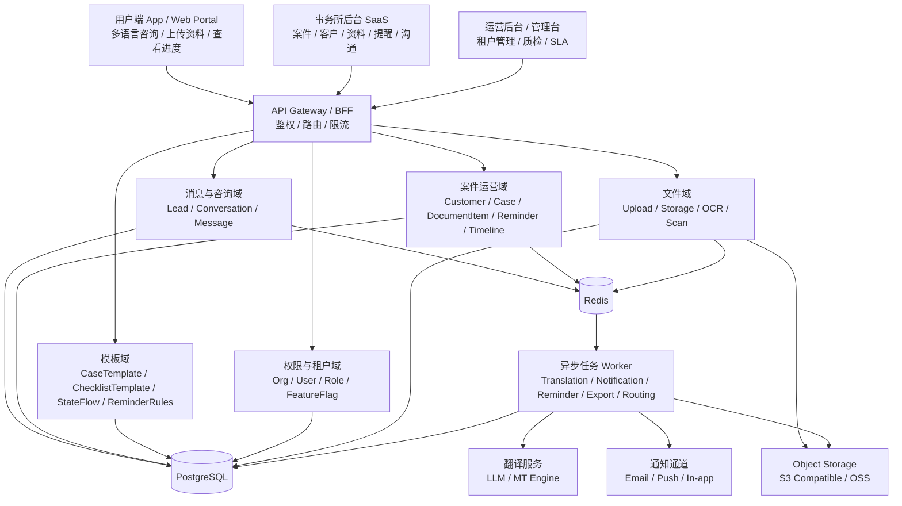
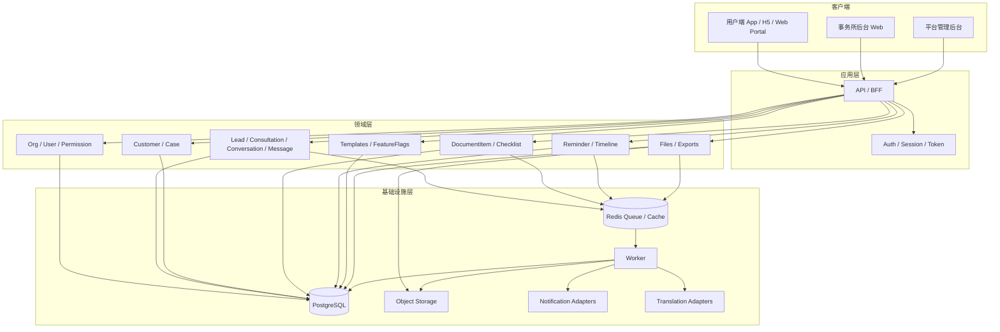
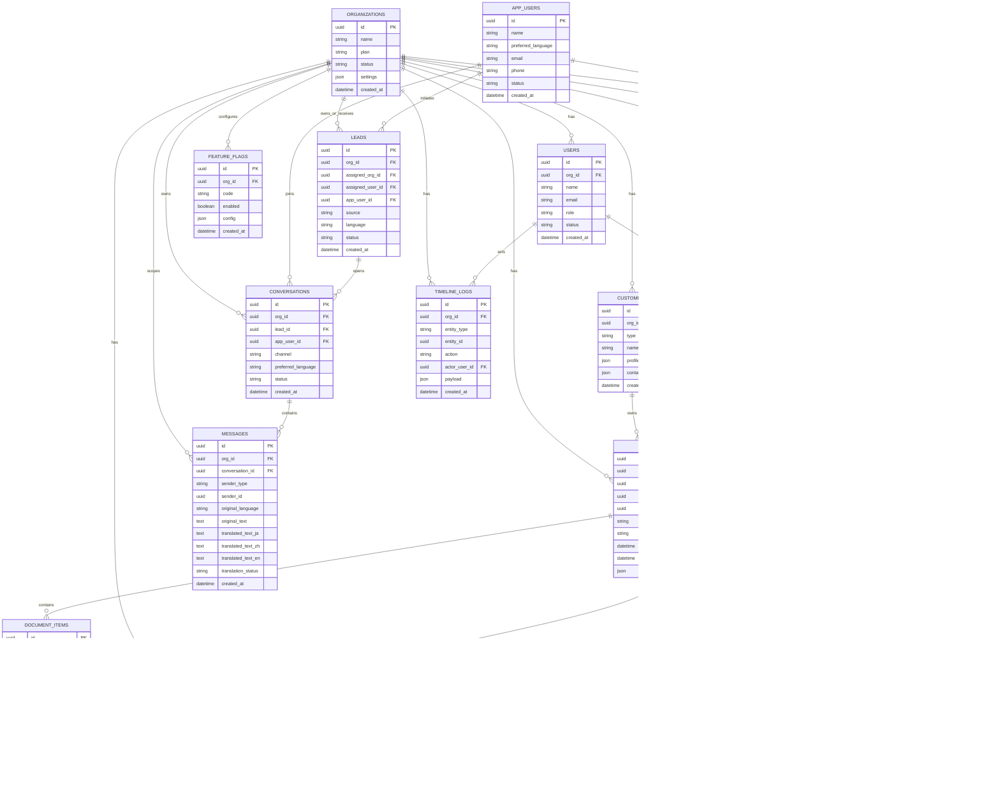

# Mermaid 架构图集合

## 1. 整体架构图（逻辑视图）

```mermaid
flowchart TD
    U[用户端 App / Web Portal<br/>多语言咨询 / 上传资料 / 查看进度]
    A[API Gateway / BFF<br/>鉴权 / 路由 / 限流]
    B[事务所后台 SaaS<br/>案件 / 客户 / 资料 / 提醒 / 沟通]
    C[消息与咨询域<br/>Lead / Conversation / Message]
    D[案件运营域<br/>Customer / Case / DocumentItem / Reminder / Timeline]
    E[模板域<br/>CaseTemplate / ChecklistTemplate / StateFlow / ReminderRules]
    F[权限与租户域<br/>Org / User / Role / FeatureFlag]
    G[文件域<br/>Upload / Storage / OCR / Scan]
    H[异步任务 Worker<br/>Translation / Notification / Reminder / Export / Routing]
    I[(PostgreSQL)]
    J[(Redis)]
    K[Object Storage<br/>S3 Compatible / OSS]
    L[通知通道<br/>Email / Push / In-app]
    M[翻译服务<br/>LLM / MT Engine]
    N[运营后台 / 管理台<br/>租户管理 / 质检 / SLA]

    U --> A
    B --> A
    N --> A

    A --> C
    A --> D
    A --> E
    A --> F
    A --> G

    C --> I
    D --> I
    E --> I
    F --> I
    G --> I

    G --> K

    C --> J
    D --> J
    G --> J

    J --> H
    H --> M
    H --> L
    H --> I
    H --> K

```

## 2. 模块分层图（代码/系统边界）

```mermaid
flowchart TB
    subgraph Client["客户端"]
        U1[用户端 App / H5 / Web Portal]
        U2[事务所后台 Web]
        U3[平台管理后台]
    end

    subgraph AppLayer["应用层"]
        A1[API / BFF]
        A2[Auth / Session / Token]
    end

    subgraph DomainLayer["领域层"]
        D1[Org / User / Permission]
        D2[Lead / Consultation / Conversation / Message]
        D3[Customer / Case]
        D4[DocumentItem / Checklist]
        D5[Reminder / Timeline]
        D6[Templates / FeatureFlags]
        D7[Files / Exports]
    end

    subgraph InfraLayer["基础设施层"]
        I1[(PostgreSQL)]
        I2[(Redis Queue / Cache)]
        I3[Object Storage]
        I4[Worker]
        I5[Notification Adapters]
        I6[Translation Adapters]
    end

    U1 --> A1
    U2 --> A1
    U3 --> A1

    A1 --> A2
    A1 --> D1
    A1 --> D2
    A1 --> D3
    A1 --> D4
    A1 --> D5
    A1 --> D6
    A1 --> D7

    D1 --> I1
    D2 --> I1
    D3 --> I1
    D4 --> I1
    D5 --> I1
    D6 --> I1
    D7 --> I1

    D2 --> I2
    D4 --> I2
    D5 --> I2
    D7 --> I2

    D7 --> I3

    I2 --> I4
    I4 --> I5
    I4 --> I6
    I4 --> I1
    I4 --> I3

```

## 3. 数据库设计图（ER）

```mermaid
erDiagram
    ORGANIZATIONS {
        uuid id PK
        string name
        string plan
        string status
        json settings
        datetime created_at
    }

    USERS {
        uuid id PK
        uuid org_id FK
        string name
        string email
        string role
        string status
        datetime created_at
    }

    APP_USERS {
        uuid id PK
        string name
        string preferred_language
        string email
        string phone
        string status
        datetime created_at
    }

    CUSTOMERS {
        uuid id PK
        uuid org_id FK
        string type
        string name
        json profile
        json contacts
        datetime created_at
    }

    CASE_TEMPLATES {
        uuid id PK
        uuid org_id FK
        string code
        string name
        string initial_status
        uuid checklist_template_id FK
        uuid reminder_rule_set_id FK
        datetime created_at
    }

    DOCUMENT_CHECKLIST_TEMPLATES {
        uuid id PK
        uuid org_id FK
        string code
        string name
        json items
        datetime created_at
    }

    CASES {
        uuid id PK
        uuid org_id FK
        uuid customer_id FK
        uuid case_template_id FK
        uuid owner_user_id FK
        string case_type_code
        string status
        datetime opened_at
        datetime due_at
        json metadata
    }

    DOCUMENT_ITEMS {
        uuid id PK
        uuid org_id FK
        uuid case_id FK
        string checklist_item_code
        string name
        string status
        datetime requested_at
        datetime received_at
        datetime reviewed_at
        datetime due_at
        string owner_side
        datetime last_follow_up_at
    }

    LEADS {
        uuid id PK
        uuid org_id FK
        uuid assigned_org_id FK
        uuid assigned_user_id FK
        uuid app_user_id FK
        string source
        string language
        string status
        datetime created_at
    }

    CONVERSATIONS {
        uuid id PK
        uuid org_id FK
        uuid lead_id FK
        uuid app_user_id FK
        string channel
        string preferred_language
        string status
        datetime created_at
    }

    MESSAGES {
        uuid id PK
        uuid org_id FK
        uuid conversation_id FK
        string sender_type
        uuid sender_id
        string original_language
        text original_text
        text translated_text_ja
        text translated_text_zh
        text translated_text_en
        string translation_status
        datetime created_at
    }

    USER_DOCUMENTS {
        uuid id PK
        uuid app_user_id FK
        uuid lead_id FK
        uuid case_id FK
        uuid file_id FK
        string doc_type
        string status
        datetime uploaded_at
    }

    REMINDERS {
        uuid id PK
        uuid org_id FK
        uuid case_id FK
        string reminder_type
        string status
        datetime scheduled_at
        datetime sent_at
    }

    TIMELINE_LOGS {
        uuid id PK
        uuid org_id FK
        string entity_type
        uuid entity_id
        string action
        uuid actor_user_id FK
        json payload
        datetime created_at
    }

    FEATURE_FLAGS {
        uuid id PK
        uuid org_id FK
        string code
        boolean enabled
        json config
        datetime created_at
    }

    FILES {
        uuid id PK
        uuid org_id FK
        string storage_key
        string filename
        string mime_type
        int size
        datetime created_at
    }

    ORGANIZATIONS ||--o{ USERS : has
    ORGANIZATIONS ||--o{ CUSTOMERS : has
    ORGANIZATIONS ||--o{ CASES : has
    ORGANIZATIONS ||--o{ LEADS : owns_or_receives
    ORGANIZATIONS ||--o{ CONVERSATIONS : owns
    ORGANIZATIONS ||--o{ MESSAGES : scopes
    ORGANIZATIONS ||--o{ REMINDERS : has
    ORGANIZATIONS ||--o{ TIMELINE_LOGS : has
    ORGANIZATIONS ||--o{ FEATURE_FLAGS : configures
    ORGANIZATIONS ||--o{ FILES : stores
    ORGANIZATIONS ||--o{ CASE_TEMPLATES : defines
    ORGANIZATIONS ||--o{ DOCUMENT_CHECKLIST_TEMPLATES : defines

    CUSTOMERS ||--o{ CASES : owns
    USERS ||--o{ CASES : handles
    CASE_TEMPLATES ||--o{ CASES : instantiates
    DOCUMENT_CHECKLIST_TEMPLATES ||--o{ CASE_TEMPLATES : backs

    CASES ||--o{ DOCUMENT_ITEMS : contains
    CASES ||--o{ REMINDERS : schedules
    CASES ||--o{ USER_DOCUMENTS : may_attach

    APP_USERS ||--o{ LEADS : initiates
    APP_USERS ||--o{ CONVERSATIONS : joins
    APP_USERS ||--o{ USER_DOCUMENTS : uploads

    LEADS ||--o{ CONVERSATIONS : opens
    CONVERSATIONS ||--o{ MESSAGES : contains

    FILES ||--o{ USER_DOCUMENTS : backs
    USERS ||--o{ TIMELINE_LOGS : acts

```
